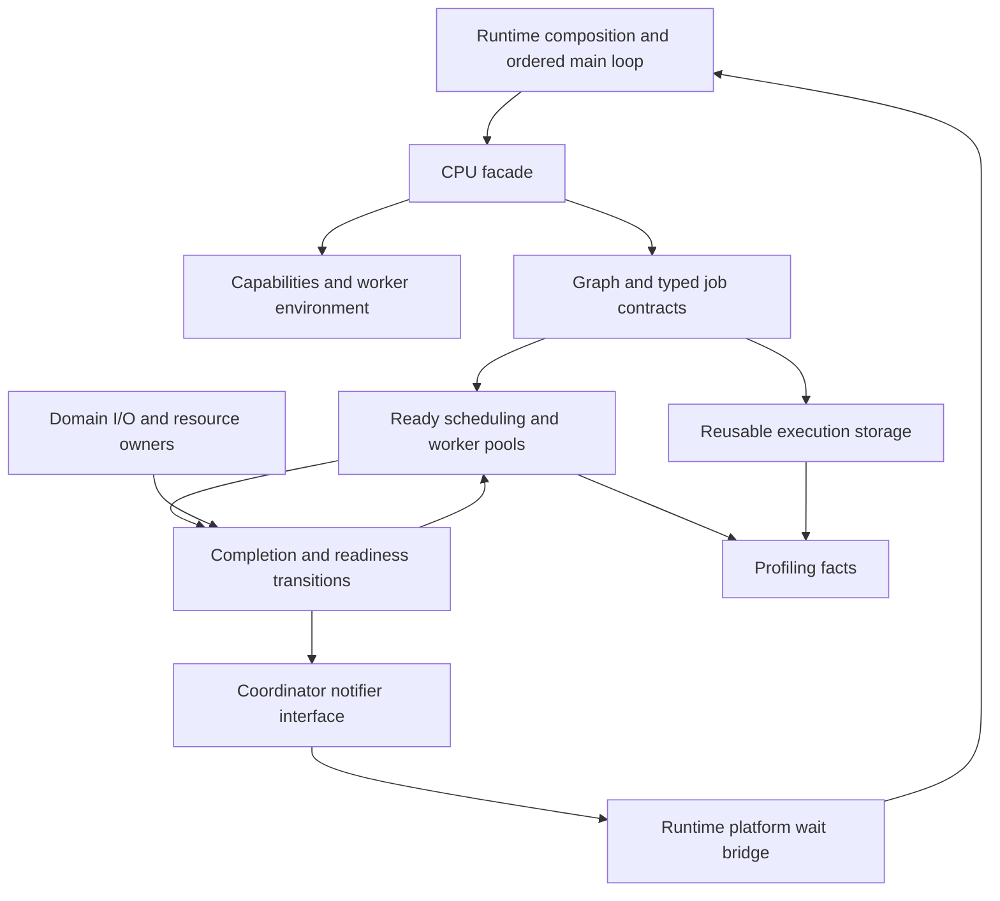

# CPU crate composition and supporting contracts

Status: design for implementation, 2026-09-15. Completes the supporting
contracts for the [frame-job design](cpu-frame-job-design.md) and its
[resource-cache companion](resource-cache-residency-design.md). No runtime
change, new package or performance result is included.

## Scope and existing code

`solarity-cpu` owns finite computation, execution storage and synchronization
needed to make that computation progress. Runtime chooses machine policy and
owns the application loop. Asset/UI/media/rendering modules retain their own
resource and gameplay semantics. Profiling consumes execution facts.

The current [crate facade](../../crates/cpu/src/lib.rs) exports a bounded
executor, task handles, Blizzard random state and a reciprocal-square-root
primitive. `job/types.rs` and the stock thread/lock seed modules remain
responsibility placeholders. They do not constitute a complete job API or
platform abstraction. Existing executor admission, panic reporting and owned
shutdown remain requirements during migration.

This document closes three previously incomplete contracts:

1. Capability discovery and a consistent worker execution environment.
2. Reusable typed execution storage with explicit reuse/growth boundaries.
3. Worker/coordinator wakeup and external-completion integration.

Stock's tracked thread lifecycle (`007700A0`, `0076FF30`), scheduled contexts
(`0047EFF0`) and explicit M2 parallel joins (`0081BFA0`, `0081BFD0`) inform
ownership and synchronization. They do not prescribe the modern API below.
Stock numeric behavior continues to use existing native evidence and tests;
capability detection does not authorize a mathematically different algorithm.

## Composition and public surface

| CPU module | Owns | Explicitly outside its ownership |
| --- | --- | --- |
| `capabilities` | Immutable usable-CPU report and approved kernel capabilities | Graphics capability/quality selection, automatic worker-count policy |
| `environment` | Worker startup handshake, numeric execution contract and teardown | Gameplay clocks or worker-local copies of global RNG streams |
| `job` | Typed identity, leased job state, result/failure and cancellation vocabulary | M2, terrain or UI validity rules |
| `graph` | Reusable dependency definitions, epoch binding, prerequisite readiness | Scene traversal, stock ordering decisions, arbitrary future-frame dependencies |
| `storage` | Node/edge/result metadata, typed reusable job cells, scratch leases and execution byte accounting | Asset caches, GPU allocations, general application heap replacement |
| `pool` | Protected/flexible policy enforcement, ready queues, dispatch, parking and shutdown | Tokio I/O, decoder-owned hidden pools, application publication |
| `completion` | Completion ports, external-ready tokens and coordinator wake protocol | SDL/window access, callbacks into gameplay from workers |
| `diagnostics` | Lifecycle, occupancy, waits and storage facts | Formatting, capture-file writing and domain memory census |
| `random` / `reciprocal` | Existing proven numeric primitives and contracts | Unverified fast-math modes or a SIMD rewrite project |

The composition root constructs an executor from an explicit policy, capacity
plan, worker environment and coordinator notifier. Domain code sees typed graph
and lease APIs through the facade. Queue internals, OS handles, Rayon types,
storage indexing and readiness counters remain private.



Arrows show runtime flow and ownership interfaces, not Rust dependency cycles.
Worker completions unlock successors without a round trip through main.
Main-only successors emit tokens to runtime's ready list. CPU has no dependency
on runtime, SDL, asset, media or rendering; profiling has no dependency back
on CPU. The executor owns the shared scheduler state and its lifecycle.

Proposed facade vocabulary (contracts, not compiling signatures):

- `CpuCapabilities`, `CpuExecutionPlan`, `WorkerEnvironment`.
- `CpuExecutor`, `FrameEpoch`, `LoadEpoch`, `GraphTemplate`, `GraphBinding`.
- `JobReservation`, `JobStateLease<S>`, `Output<T>`, `SharedOutput<T>`.
- `JobContext`: a scoped scratch/cancellation/diagnostic view, without access
  to blocking services, global RNG or the application's mutable state.
- `CpuStoragePlan`, `StorageSnapshot`, `ScratchScope`, `ResultPageLease<T>`.
- `CompletionPort`, `ExternalReadyToken`, `CoordinatorNotifier`, `WakeTicket`.
- `CpuError`, `WaitBoundary`, and read-only executor/diagnostic snapshots.

`CpuExecutionPlan` refines the old worker-count configuration into explicit
protected/flexible/bulk counts; it does not silently reinterpret the existing
`--cpu-workers` value. Installation/configuration migration reports the resolved
plan and validates it before starting work. One configured compute worker
remains supported as described in the frame-job design.

## Capabilities and worker environment

### Discovery and dispatch

Discover capabilities once during startup through the CPU module's platform
leaf. Report architecture, available execution concurrency, usable instruction
features and optional physical-core/topology information. Differentiate unknown
topology from a reported one-core machine. Detailed topology is advisory; an
explicit valid worker plan does not need invented physical-core information.

Runtime chooses the worker plan using this report, user configuration and the
whole-process budget. CPU validates that plan and reports what it instantiated.
Do not promise that a worker owns a physical core or treat every SMT/hybrid
logical processor as equal throughput. Fixed affinity, NUMA placement and
hot resizing remain outside the first implementation. If execution constraints
change, preserve correctness and report them; reconfiguration requires an
explicit quiescent lifecycle boundary.

Feature dispatch requires a feature that is usable by the process on every
processor where the job may run, including required OS support. Use established
platform/Rust feature detection in a narrow implementation; do not scatter raw
CPUID decisions across domain kernels. Resolve approved implementations outside
the per-element hot loop. A new instruction path needs parity evidence and a
measured benefit before it enters the dispatch table.

The existing [reciprocal estimate](../../crates/cpu/src/reciprocal.rs) preserves
stock's direct SSE estimate and returns `None` when that path is unavailable,
allowing its proven scalar consumer behavior. Keep that contract: detecting a
newer ISA does not authorize refining the estimate, enabling contraction,
changing reduction order or selecting a new fallback. Broader vectorization
remains a later kernel change, not an automatic consequence of this module.

### Startup handshake

An executor is not accepting until every required worker has:

1. Received its stable worker ID, class and execution-environment descriptor.
2. Established/verified the approved numeric environment relevant to its kernels.
3. Acquired its bounded initial scratch and scheduler-local state.
4. Registered thread identity and reported initialization success.

If one worker fails initialization, close admission, stop and join the workers
already created, and return a typed startup error. Do not silently start with
fewer workers or change numeric mode. The thread handles and partial allocations
remain owned during rollback. Profiling registration/capture-buffer cold costs
are identified separately and do not require large trace buffers while F10 is off.

`WorkerEnvironment` describes numeric assumptions and their verification;
implementation must derive actual control settings from the relevant stock and
existing production-kernel evidence. Do not guess rounding or denormal settings
because one mode benchmarks faster. Apply the same approved contract to main
when it executes those kernels. Run parity fixtures on both execution paths.

Foreign decoders or libraries capable of changing thread state use the declared
bulk boundary. Reestablish/verify the required environment before that worker
returns to parity kernels. No per-bone environment resets. A violated invariant
is reported and affected work is not published as a valid result.

Worker ID is diagnostic/execution identity, not RNG identity. Global stock random
streams remain under ordered domain ownership; CPU does not automatically seed
one random stream per worker. Scheduler completion order cannot select randomness.

## Reusable execution storage

### Three lifetimes

| Storage | Lifetime and reuse condition |
| --- | --- |
| Graph template and registered job cells | Survive frames while dependency/operation structure is valid; retired after all bindings end |
| Epoch activation and result metadata | Reusable after jobs are terminal, consumers have released results, and no external completion can refer to that binding |
| Worker scratch | Exclusively borrowed during a synchronous operation; reset after the borrow ends; references cannot escape into results |

An immutable result that survives the job belongs in a leased result page or
domain-owned allocation, not a pointer into resettable scratch. GPU-consumed
storage remains rendering-owned/pinned to GPU completion; job completion is
insufficient to recycle it. A resource-cache lease pins its domain allocation;
the CPU storage pool does not copy that allocation into a second cache.

### Safe typed job cells

Use reusable typed cells for hot frame operations. Register an operation and its
state/result representation when the owning batch/template is established.
Each activation binds fresh inputs and generation/order identities to a leased
cell. The ready queue carries a compact checked cell/node handle, not a new
boxed closure with a newly cloned object graph for every model every frame.

An implementation can use a safe registered dispatch interface with typed cells
behind it. Any type-erased adapter is allocated at registration/growth, preserves
typed access, and does not use raw-pointer lifetime extension. Per-cell guards
may protect ownership transfer; user computation runs with exclusive leased
state after releasing the guard. There is no global storage lock around bodies.

The executor wrapper retains the state lease outside the operation's unwind
boundary and passes a mutable borrow into the body. Terminal results return
the lease even on panic/cancellation. Potentially modified state is marked
unusable after panic and follows the domain's failure/retirement handling.
Result visibility, dependent readiness and lease reuse are separate transitions.

General finite background operations may retain the existing owned-closure
adapter during migration. Its allocation and destructor costs are accounted
for; it is not the hot frame representation. Do not build a general-purpose
arena allocator or custom untyped task language to remove one adapter allocation.

### Handles, graph binding and reuse

Every reusable handle contains slot and generation; frame/load epoch identity
is checked where results cross consumers. Reuse advances the generation, and
wrap/exhaustion has an explicit error/quiescent rebuild contract rather than
silently allowing an old handle to become valid. No vector index alone crosses
an asynchronous boundary. A slot is not reusable merely because a caller
dropped its result handle while the worker still runs.

A `GraphTemplate` stores validated dependency structure and registered operations.
`GraphBinding` supplies one epoch's inputs, active owners, readiness counts and
output slots. Reset work is proportional to activated batches/edges. Stable
scene work does not recreate the entire graph or scan inactive cached models.
Structural changes patch/rebuild the affected template only after prior bindings
are protected; unrelated graphs remain usable. Dynamic event-generated work
uses the already-defined bounded append rule and a reserved continuation budget.

Frame, required-load and speculative reservations are separately accounted.
Reserve the connected required phase's nodes, edges, outputs and bounded transient
working set before dispatch. External readiness tokens occupy reserved records
until completed/cancelled and acknowledged. Speculation cannot exhaust the
metadata needed to finish or publish current work.

### Capacity, locality and accounting

`CpuStoragePlan` supplies initial capacities and count/byte limits for metadata,
job cells, scratch and result pages. It is distinct from the resource cache's
asset/VRAM budget. Record actual reserved capacity and allocation identity so
the same bytes are not reported once as CPU scratch and again as an asset.
If a result allocation transfers into a retained domain cache, transfer its
accounting category under the same allocation identity; do not copy it solely
to cross the API or count both ownership stages as simultaneous live memory.

Grow outside the measured steady-state path when possible. If an unexpected
required phase needs growth, report it as admission/growth work and preserve its
inputs. Do not truncate work, allocate an unbounded overflow list, or run a large
destructor on main as a consequence of failed admission. An infeasible connected
working set returns a typed capacity result; consumers cannot wait on themselves
to free the missing reservation.

Typed scratch containers reuse their capacities. Trim only at an explicit
maintenance boundary after use ends; CPU-retained capacity is not free memory
until actually released. One unusual scene must not permanently multiply a huge
scratch allocation by every worker. Track per-worker/operation peaks and retain
only justified warm capacity under the configured byte allowance.

Separate frequently written worker metadata where contention warrants it;
keep batch data contiguous and avoid blanket padding of domain objects. Measure
allocation count, copied bytes, storage-lock waits and execution scaling before
introducing custom allocators or NUMA-aware machinery.

## Completion, wakeups and external readiness

### Durable readiness before notifications

Completion is a state transition, not an event payload that can be dropped.
The producer publishes its result and terminal state before making successors
ready and notifying waiters. A reserved ready record/bit identifies work until
its consumer acknowledges it. Diagnostic loss never implies completion loss.

`CompletionPort` lets a producer finish a registered operation once. An
`ExternalReadyToken` permits the domain I/O/resource owner to signal a specific
reserved dependency with its generation and success/failure outcome. It cannot
run a gameplay callback or mutate graph structure arbitrarily. Late, duplicate
or stale completion is rejected or recognized as the already-terminal outcome;
it never releases the same lease twice or wakes a new occupant of an old slot.

One shared resource readiness operation may have many consumer subscriptions.
Cancelling a consumer removes only its own edge/pin; it does not fail other
consumers. CPU knows readiness, while the resource owner defines whether that
token means decoded data, a created graphics handle or a later readiness stage.
Never label a GPU upload complete merely because its CPU submission returned.

Workers completing predecessors make eligible worker successors runnable
directly. Main-only successors enter runtime's ready-token list. An external
completion follows the same path. No parked worker waits for main to discover
ordinary worker-to-worker readiness.

### Worker parking

Use a predicate and sequence protected by the scheduling synchronization
boundary. Enqueue and park registration form a race-safe protocol: a worker
rechecks eligible work after registering its intention to park; a producer
publishes work before advancing/notifying that predicate. Spurious wakeups
recheck the predicate. Notify only the needed eligible workers; shutdown wakes
all. User operations, cancellation destructors and result consumption do not
run while holding this lock.

The implementation must test enqueue-before-park, enqueue-during-arm and
shutdown-during-park. Merely pairing an atomic `is_empty` check with a later
condition-variable wait is not sufficient evidence of correctness.

### Coordinator notifier protocol

`CoordinatorNotifier` is a small thread-safe non-gameplay interface supplied by
runtime. It owns a durable wake sequence and a coalesced native signal. A
`WakeTicket` records the sequence observed before main's final drain/check.

1. A producer first publishes a ready record, then advances the wake sequence.
2. Main drains permitted ready work and polls platform events, then asks to arm
   a wait against its observed sequence and current ready predicate.
3. Arming succeeds only if the sequence is unchanged and no permitted work is
   ready. Resetting the coalesced signal and arming are synchronized with signal
   producers, so a notification cannot be reset after it published unseen work.
4. While armed, the first notification signals the native wait; later ones
   coalesce. On wake main disarms, refreshes its sequence and drains again.
5. A stale/duplicate signal is harmless. It may cause another check, but cannot
   cause duplicate consumption or erase readiness.

Queue publication finishes before notifier synchronization; producers never
hold a queue lock while signalling the platform. Main's arm protocol may check
the ready predicate only through the documented lock order. No SDL pumping,
callbacks or arbitrary closures run under the notifier lock. Generation checks
and the sequence prevent lost wakeups, not a belief that OS events are counts.

### Current Windows/SDL integration

The current [SDL platform owner](../../crates/runtime/src/platform/sdl_platform.rs)
polls events; it does not yet implement this bridge. The pinned `sdl3` 0.18.4
source provides an event sender and timed waits, but its duration-based event
wait converts to whole milliseconds. Blindly using it for sub-millisecond frame
deadlines can turn a short wait into polling. An SDL user event alone also must
not carry the only copy of a required completion.

For the current Windows backend, runtime/platform owns a native notification
event, a deadline timer and the main-thread event-pump integration. Wait for
the notification/timer together with window messages using
[`MsgWaitForMultipleObjectsEx`](https://learn.microsoft.com/en-us/windows/win32/api/winuser/nf-winuser-msgwaitformultipleobjectsex).
Use wait-any behavior and account for already-observed queued input through
`MWMO_INPUTAVAILABLE`; return to SDL to pump/translate events, without a second
gameplay input dispatcher. The CPU crate receives only the notifier interface.

Use an available high-resolution waitable timer for short scheduler deadlines;
the feature is supported from Windows 10 version 1803. Initialization establishes
that capability or reports an explicit unsupported/initialization result; this
design adds no silent spin or sleep fallback.
See [timer creation](https://learn.microsoft.com/en-us/windows/win32/api/synchapi/nf-synchapi-createwaitabletimerexw).
Arm a one-shot relative due time derived from the monotonic deadline, with no
APC callback into gameplay. Due-time units do not guarantee actual wake latency;
measure overshoot. See [timer activation](https://learn.microsoft.com/en-us/windows/win32/api/synchapi/nf-synchapi-setwaitabletimer).

Before native waiting, drain/check SDL's internal queue as well as CPU readiness.
SDL events produced without a new window message must also signal the bridge:
use a narrowly owned event-watch/wakeup adapter that only advances the notifier,
never filters events or calls gameplay. Verify the pinned SDL watch lifecycle
and all actual background event producers in integration tests. CPU completions
use the native signal directly, with no per-job heap-allocated SDL event.

Native wait, timer and notification failures are explicit platform failures;
they cannot turn into an indefinite successful wait. Latch producer-side signal
faults for main/reporting, keep finite runtime maintenance deadlines armed, and
handle failed waits on main. Do not call user operations from an error-signalling
path. Supporting another OS or a different timer capability requires an explicit
backend contract; it is not an invented stock data fallback.

Main waits only when it has no permitted useful work. A completed input event
is collected promptly but changes gameplay only at the ordered-state cutoff
defined by the frame design. GPU-slot and loading waits continue to service
required main continuations and platform events. No general worker can pump SDL.

### Time and teardown

Scheduler deadlines use a monotonic duration domain. Existing
[client milliseconds](../../crates/runtime/src/platform/clock.rs) and stock
wrapping cache/animation clocks remain separate; do not replace them with job
completion time. Runtime supplies its earliest frame/input-service/maintenance
deadline to the bridge. CPU is not a replacement general timer runtime.

The platform bridge is created before opening executor/external admission.
During shutdown stop new producers, resolve/cancel their owned work and service
remaining main continuations. Join workers/services before detaching notifier
backends; then remove SDL watches, release external tokens and close native wait
handles before SDL teardown. A notifier cannot outlive the handle it signals.
No shutdown thread holds a handle/result lock while waiting for its producer.

## Folder map and construction sequence

```text
crates/cpu/src/
  lib.rs                         narrow public facade
  capabilities/mod.rs            report and approved dispatch vocabulary
    report.rs / detect.rs / dispatch.rs
  environment/mod.rs             worker environment facade
    startup.rs / numeric.rs / shutdown.rs
  job/mod.rs                     identity, state lease, outputs and outcomes
  graph/mod.rs                   templates, epoch binding and readiness
  storage/mod.rs                 execution capacity and typed leases
    plan.rs / cells.rs / results.rs / scratch.rs / accounting.rs
  pool/mod.rs                    executor, policy, queues and parking
  completion/mod.rs              external completion and wake protocol
    port.rs / external.rs / notifier.rs
  diagnostics/mod.rs             bounded observations
  random/                        existing stock numeric stream
  reciprocal.rs                  existing stock numeric primitive

crates/runtime/src/
  platform/wakeup/mod.rs          platform-owned wait facade
    windows.rs / sdl_watch.rs / status.rs
  application/frame_pipeline/    main-ready continuations and epoch coordination
```

Stock-named empty `synchronization` seed files are folded into the concrete
parking/notifier responsibilities when those are implemented; they are not a
reason to wrap every standard mutex in another public lock type.

Construction order: initialize platform and wake bridge -> discover CPU
capabilities -> resolve explicit execution/storage plans -> register graph/job
types -> initialize workers and complete their handshake -> open admission.
Register domain resource producers without a CPU-to-domain dependency. A later
registration/growth operation occurs at a defined owner boundary, not inside
every frame kernel. Teardown follows the owned dependencies in reverse after
continuations and external producers have drained.

## Integration and acceptance gates

Implement these contracts in the [direct cutover](cpu-frame-job-design.md#direct-cutover-and-review-gates), using real
M2 pose/geometry job state. Do not build disconnected generic storage or wakeup
libraries first and leave the existing synchronous frame calls unchanged.

| Contract | Required evidence before the cutover is accepted |
| --- | --- |
| Capabilities/environment | Explicit and unknown topology cases; unsupported instruction path; partial worker initialization rollback; approved numeric fixtures on main and every worker; foreign-state boundary test |
| Storage | Stable-graph allocation counts after warmup; no per-frame boxed task construction; stale generation and handle-reuse tests; fan-out lifetimes, panic and cancellation lease return; scratch cannot escape; bounded growth/infeasible transaction handling |
| Worker wakeup | Controlled enqueue/arm/reset/shutdown interleavings, spurious wakeups and class eligibility; no ready work stranded behind a sleeping eligible worker |
| Main wake bridge | Completion before/during/after arming; window input and internal SDL events while parked; bursts coalesce without lost results; timer overshoot, native failure, teardown with late producers; no zero-timeout busy loop |
| External readiness | Multiple consumers, one cancellation, late/double completion, failed dependency and retired generation; ordinary successors run without main polling |
| End-to-end | Main advances useful independent work while a real batch runs; correct publication order; frame/input-latency, CPU service, memory and diagnostic-overhead comparisons |

Use deterministic fake capabilities/clocks/notifiers and controlled interleavings
for portable tests, then Windows integration tests for the real platform bridge.
Compile-time ownership checks cover non-Send main state and escaping scratch
borrows. Tests belong outside `src`. Report platform limitations honestly;
successful fake-notifier tests do not prove native event-pump behavior.

The frame design's 0.833 ms target, whole-frame scaling matrix, storage budget
and diagnostic overhead gates still apply. These are design requirements, not
claims that thread startup, a high-resolution timer or a cache automatically
produces 1,200 FPS. No further foundational CPU subsystem is identified here;
remaining work is integration and evidence-driven refinement of these contracts.
