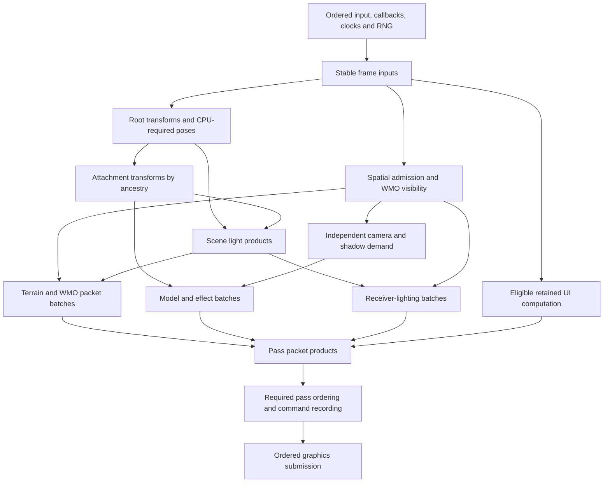

# CPU frame jobs and ordered publication

Status: design for implementation, 2026-09-15. No runtime change is made by
this document. The user requested a modern CPU architecture grounded in stock
behavior and directed toward 1,200 completed frames per second. This is the
implementation contract proposed for that work, not a measured performance claim.

The companion [resource cache and residency design](resource-cache-residency-design.md)
defines shared pending resources, typed cache validity, memory budgets and
stock-compatible retention/prefetch. CPU jobs execute that work; its domain
policy remains outside the CPU scheduler.

## Objective and limits

The steady-frame target is **0.833 ms per completed frame**. Shorten the CPU
critical path, use available cores for independent computation, and prevent
loading, publication or destruction from unexpectedly occupying that path.
The design applies while moving and changing content, as well as standing still.
Loading transitions have separately reported readiness latency; they cannot
be hidden by excluding their stalls from the ordinary-frame report.

Stock defines observable behavior: visibility, ordering, clocks, callbacks,
RNG consumption, movement, resource readiness and error handling. It does not
require a single-threaded implementation, a fixed pool split, D3D9, or a clone
of its allocator. The inspected stock build itself has workers and an optional
parallel M2 preparation path.

Scheduling cannot guarantee 1,200 FPS. At minimum, CPU frame time is bounded by
both the longest required dependency chain and useful CPU work divided by
effective compute capacity. For example, 8 ms of CPU work on five effective
cores still needs at least 1.6 ms before scheduling overhead. GPU throughput,
presentation backpressure and memory bandwidth are independent limits. CPU and
GPU may overlap; do not add their overlapping durations or call submission rate
completed FPS. Work elimination and GPU improvements remain necessary where
these bounds exceed the target.

The earlier 300 FPS budget in [frame-performance.md](frame-performance.md)
describes previous work. It is not the acceptance target of this design.

## Evidence and present limitations

Baseline: `perf/critical-frame-work`, runtime source through Build 137;
stock review committed at `09852dd1`. See the
[stock operating-model review](stock-performance-review-2026-09-15.md) for
the pinned executable hash, 74 selected exports, native tests and research gaps.

| Stock evidence | Contract retained in this design |
| --- | --- |
| `0047EFF0`, `0047D3C0`: scheduled contexts and registered handlers | Explicit ownership and readiness; parked work does not require spinning. No invented simulation frequency. |
| `004BA680`, `004B9B20`, `007B6B00`: reads, completion callbacks and loading barriers | File readiness, CPU preparation and publication are different stages. Required world-entry dependencies remain required. Stock's initial 100 ms callback budget is not adopted as a modern frame budget. |
| `00832450`, `00832260`: model callbacks and sequence events | Preserve callback order and event intervals independently of mesh visibility. |
| `00823F10`, `00821A20`: scene registration and preparation | Cache residence does not make a model active. Render, shadow, light and callback demands remain distinct. |
| `0081CE70`, `0081BFA0`, `0081BFD0`: optional parallel root preparation | Independent roots can have parallel calculation; observed stock enablement is unknown. |
| `00827190`, `00831C30`, `0083DA10`: sequence requests and shared pending loads | Shared, demand-driven readiness and deduplicated requests. |
| `0083DC90`, `00835970`, `0081C290`: qualified release/reacquisition/collection | Correct scene membership is separate from timed shared-resource retention. |
| `007831A0`, `007B5950`, `007A50C0`: current window and persistent spatial references | Current demand precedes admission; local membership changes do not require a global index rebuild. |

Current code already supplies useful foundations:

- [CpuExecutor](../../crates/cpu/src/pool/executor.rs) owns persistent Rayon
  workers, finite admission, structured shutdown and task failures. Tokio is
  separate. These contracts stay.
- Testing specifies four CPU workers. The executor divides them into two
  background and two frame workers, irrespective of current demand.
- [Frame execution](../../crates/cpu/src/pool/frame.rs) calls `pool.install`
  and joins before returning. Its only production consumers are
  [unit poses](../../crates/runtime/src/application/terrain_frame/m2/preparation/poses/frame.rs)
  and [geometry](../../crates/runtime/src/application/terrain_frame/m2/preparation/geometry/publication.rs).
  They collect inputs serially and use a count threshold of eight jobs.
- [M2 preparation](../../crates/runtime/src/application/terrain_frame/m2/preparation/frame.rs)
  combines ordered state changes, spatial selection, attachments, lighting,
  worker dispatch, restoration, publication and sorting. Its mutable owners
  include `Rc`/`RefCell` state; they cannot simply be sent to workers.
- [World preparation](../../crates/runtime/src/application/terrain_frame/mod.rs)
  consumes M2's WMO traversal and light results before preparing other geometry.
  This imposes a subsystem-wide dependency where consumers need narrower products.
- Geometry jobs already own temporary effects/scratch. Immutable models are
  shared. Extend those boundaries rather than copying the complete world.
- [F10 profiling](../../crates/runtime/src/application/frame_profile/control.rs)
  already has bounded trace records, cross-thread identities and an off-thread
  writer. Extend it; do not add a synchronous warning stream.

The latest capture metadata says four CPU workers and two network workers.
These are configured threads, not four cores continuously helping the frame.
This design does not reinterpret joined scope wall time as idle CPU time.

## Architecture decisions

1. Replace whole-batch frame joins with a bounded dependency scheduler and
   completion-driven main-thread continuations.
2. Preserve an ordered main-thread state owner. Move independent calculations,
   not arbitrary shared mutable world/Lua objects, into jobs.
3. Use explicit frame, load and resource generations. Completion order never
   defines gameplay, publication or render order.
4. Give frame work protected compute capacity and first service on unreserved
   flexible capacity. Do not let non-preemptible background jobs occupy every worker.
5. Keep blocking I/O and indivisible bulk operations outside protected frame
   capacity. Do not send CPU computation to Tokio's network runtime.
6. Store outputs in reusable owner/batch storage and publish spans/handles.
   Avoid moving the former preparation cost into a serial copy-and-merge phase.
7. Make ready delay, execution, dependency waits, publication and GPU waits
   separately attributable. Diagnostics are bounded and never required for progress.
8. Start with one CPU frame epoch being prepared. No speculative extra simulation
   frame or stale-pose reuse is introduced to conceal a deadline miss.

## Execution owners and worker policy

| Owner / class | Work | Admission and scheduling |
| --- | --- | --- |
| Main coordinator | Input, Lua and ordered gameplay mutations, current demand, non-Send state, main-only continuations, initial graphics submission | Runs ready continuations and useful bounded work before waiting. No general background-job stealing. |
| Protected compute workers | Current-frame CPU jobs and their prerequisites | Persistent workers. While a frame is open, run only frame work. Park when no eligible work exists. |
| Flexible compute workers | Ready frame work, required loading, bounded speculative work and retirement slices | Lend unused background capacity to frames. While required background work is queued, reserve its minimum service allowance; other flexible capacity takes frame work first. An executing job is not preempted. |
| Blocking / bulk lanes | Synchronous archive reads, indivisible decoder calls, large unavoidable frees, blocking third-party work | Separately bounded and explicitly counted in the CPU budget if compute-heavy. Never consume all protected capacity. |
| Network runtime / audio backend | Network I/O and timers; backend audio cadence | Existing lifecycle owners. Deliver ordered events/commands; do not create a network or audio job for every rendered frame. |
| Diagnostic reporter | Aggregate slow-wait health records; analyze and format captures | Extend the existing independent bounded writer lifecycle. Never blocks producers. |

`solarity-runtime` chooses and records machine policy; `solarity-cpu` enforces
explicit counts. Record available logical/physical topology where available,
configured counts, protected/flexible counts and bulk limits. CPU topology
informs policy but is not a promise of exclusive cores. Respect explicit user
configuration and account for main-thread, driver, network and audio activity.
No fixed affinity or OS real-time thread priority is part of the initial design.

For the documented six-core i5-9600K test machine, the first comparison uses
five compute workers: four protected and one flexible. It is a starting
configuration to test, not a universal optimum. A CPU-heavy bulk operation
uses the flexible allowance or replaces it while active; it must not silently
add another full compute pool. A blocking-I/O thread may overlap these workers,
but decoding after its read returns goes through compute admission. Compare
four/five compute workers and concurrent-loading cases before setting defaults.

A single-compute-worker configuration uses one flexible lane with explicit
bounded turns for required background work. It cannot promise simultaneously
protected frame capacity and background progress. Keep it correct and measure
its latency rather than creating hidden threads or deadlocking on a dependency.
Zero compute workers is rejected by configuration. On larger machines the
protected/flexible split remains explicit and recorded; logical processors are
not assumed to have equal physical-core throughput.

Protected workers do not lend themselves to arbitrary background work in the
gap between frames: an urgent next frame cannot preempt that work. When there
is no interactive frame owner, such as an explicit loading-only phase, runtime
may reclassify capacity after outstanding work reaches a safe boundary. When
interactive loading is overlaid on a scene, protected capacity remains intact.

Background jobs that can be divided return resumable owned state after a
bounded chunk. The initial experiment targets roughly 50-100 microseconds of
compute per chunk, measured rather than assumed. A third-party call that cannot
meet this is classified as indivisible bulk, not disguised as a short job.
Priority inheritance can promote a queued dependency and its prerequisites;
it cannot interrupt a running codec or filesystem call.
Priority and execution class are separate: promotion never makes blocking I/O
or indivisible bulk work eligible on a protected worker.

Required asset demand has priority over speculation on background capacity.
Speculation stops admission before required demand exhausts the count or byte
budget. A loading barrier consumes exactly its explicit prerequisite set.
Continuous frames must not starve required streaming. When required loading or
memory-pressure retirement is pending, the default policy reserves one flexible
worker for that service at its next job boundary. It returns to frame work when
that backlog clears. Required loading and retirement receive bounded turns, so
neither an endless load queue nor an endless retirement queue monopolizes this
allowance. Speculation has no minimum service guarantee. Thus the flexible/bulk
allowance guarantees access to required background service, not I/O latency or
immediate preemption; the default still protects four frame workers while loading.
Expired speculative demand may be cancelled at a safe boundary. Mandatory
gameplay work may not be dropped because it missed its budget.

## Scheduler contract

The initial implementation uses persistent worker loops with explicit ready
queues and parking. Keep the public CPU abstraction; replace the frame backend
where necessary to enforce classes and dependency readiness. Existing Rayon
loaders can migrate behind the bulk adapter, but their worker counts must be
included in the same configured budget. Do not nest independent full-size pools.
Using Tokio tasks or replacing `join` with an immediate `.await` does not satisfy
this contract.

The alternative of merely exposing nonblocking Rayon submissions would remove
an immediate caller wait, but would not establish prerequisite readiness,
main-only continuations, protected service or ordered result ownership. A small
scheduler with these explicit rules is the chosen boundary. Do not build a
general-purpose coroutine runtime, custom lock-free deque or new async language
abstraction as part of this work.

Jobs move through `reserved -> waiting -> ready -> running -> completed`.
Failure and cancellation are explicit terminal outcomes. Publication is a
separate consumer state; completed does not mean published or GPU-retired.

- Each node has `JobId`, `FrameEpoch` or `LoadEpoch`, owner generation, class,
  affinity, dependency count, output identity and optional diagnostic identity.
- Work units are batches, not individual glyphs, vertices, particles or bones.
  Stable batches target multiple ready jobs per eligible worker; start the
  evaluation at four to eight batches per worker. Split unusually expensive
  independent owners and coalesce small ones. Count alone is not a cost model.
- Runtime appends nodes whose parents already exist. This construction rule
  makes a cycle impossible within an epoch. Cross-epoch edges are restricted
  to explicit resource-ready tokens and already completed immutable products;
  future-frame dependency cycles are forbidden.
- Registering a successor and observing a terminal parent must be one coherent
  operation. A completion racing with registration may neither lose a wakeup
  nor enqueue a node twice. Release publication precedes acquire consumption.
- The last successful prerequisite makes the node runnable. Workers never
  block waiting for prerequisite results. Failure completes dependent nodes
  with a dependency failure, while returning their owned inputs for cleanup.
- Within eligible frame work, use a few bounded priority buckets: prerequisites
  that unblock main/long downstream chains, then ordinary pass work. Coarse
  cost bins dispatch expensive independent work early within a bucket; FIFO
  breaks remaining scheduling ties. Runtime supplies hints from known work
  counts and measured calibration, without changing logical output order.
  No per-frame whole-world priority sort or correctness dependence on timing
  estimates is introduced. Report straggler tails to verify this policy.
- Main-only continuations stay in runtime with their non-Send state. CPU
  completion queues carry numeric readiness tokens, not captured Lua/world
  references. Runtime signals completion when the main-only operation finishes.
- Queue locks, if used, protect only batch push/pop and state transitions;
  no user operation runs under a scheduler lock. Begin with safe bounded
  queues. Work stealing or lock-free queues require evidence that scheduling
  contention warrants them; neither is a prerequisite for dependency execution.
- Worker parking uses a condition predicate rechecked under its synchronization
  boundary. Completion wakes the necessary workers/coordinator. No polling
  loop, unconditional millisecond sleep or permanent spin is the default.
- Frame kernels do not call file/network I/O, `block_on`, global Rayon work,
  GPU host waits or another executor's synchronous join. Domain adapters expose
  their immutable catalogs and owned state rather than service objects capable
  of hidden loading. Audit kernel call chains as well as scheduler APIs.
- Reserve nodes, edges and output capacity before transferring mandatory
  phase inputs. The graph size follows admitted work, not all cached models.
  Frame reservations cannot be exhausted by background jobs. Capacity growth
  is explicit and measured; saturation preserves the input and reports a
  typed admission result. It does not silently execute arbitrary work inline.
- Required work that cannot yet be admitted is retained by its owner. The
  coordinator advances other ready work, then records an explicit capacity
  wait if necessary. There is no unbounded overflow queue or dropped frame job.
- Reserve each dependency-connected phase's necessary continuations together;
  a producer must not fill the last slot while the consumer needed to release
  its output is unable to enter the graph. Drain ready consumers and retire
  released metadata while admitting later phases. Capacity-wait tests must
  cover this forward-progress invariant, including single-worker configurations.
- Small work may be deliberately executed inline by a declared main-safe
  operation. It is timed as computation, not disguised as a completed job.

New blocking waits require a named boundary: world-entry readiness, current
frame consumption, GPU-slot reuse, or shutdown. A worker attempting a synchronous
child wait is an API misuse. The main coordinator may wait only after exhausting
the useful ready continuations allowed by its ordering rules. It cannot run
arbitrary callbacks early just to stay busy.

## Data and API shape

The following are conceptual interfaces, not compiling declarations:

| Interface | Contract |
| --- | --- |
| `FrameEpoch` / `LoadEpoch` | Distinguish frame-local consumption from cross-frame resource readiness. |
| `JobReservation` | Reserves node/edge/admission capacity before ownership transfer. |
| `Output<T>` | Single-consumer typed result; continuation consumes `T` once. |
| `SharedOutput<T>` | Explicit immutable fan-out, normally `Arc<T>`; lifetime counted. |
| `compute(lease, operation)` | Owns a `Send` state/scratch lease; operation borrows that state and produces a typed result. |
| `then(output, input, operation)` | Runs only after success and receives predecessor data without a worker-side wait. |
| `after_all(outputs, operation)` | Explicit join dependency, runnable after required products are available. |
| `publish_when_ready(token, order_key)` | Runtime-owned continuation; execution identity and publication identity remain separate. |
| `try_consume(output)` | Returns ready outcome or retains the pending handle; never blocks or loses ownership. |
| `wait_at(boundary, token)` | Deliberate final wait with reason/identity and instrumentation; unavailable to worker bodies. |

Inputs crossing workers own their mutable state and retain immutable resources
through `Arc`. Do not make the entire `M2Frame`, asset store, Lua state or renderer
an `Arc<Mutex<_>>`. Keep `Rc`/`RefCell` gameplay owners on their existing thread;
extract compact stable facts and transfer only the relevant job payload.

Use reusable frame/batch slots holding job state, output pages and scratch.
Transfer a slot lease into a job and return it on every terminal outcome.
The executor's job wrapper holds that lease outside the operation's unwind
boundary. A closure receives a mutable borrow of state, so a panic does not
silently drop the only ownership record or leave an outstanding lease forever.
Potentially modified state is marked unusable on panic and retired by its owner.
Use safe typed ownership/result cells and batch-level synchronization first;
do not build an untyped arena of raw pointers or lifetime-extended borrows.
An immutable result shared by several consumers is released after its last
consumer, not immediately after the first continuation.

Mutation-sensitive inputs carry a generation. Main checks generation when
publishing cross-frame results; a stale completion is retired without becoming
current. An active CPU epoch pins its input generations. Scene mutations that
would invalidate them are applied at the next allowed state boundary.
GPU resource generations remain pinned through their final fence/timeline
completion, which is later than CPU job completion.

Shared resource fan-out uses one readiness node per resource generation and a
bounded consumer list. Cancelling one speculative consumer does not cancel a
load still required by another. Release the request only when its demand and
in-flight ownership permit it, independently of any later cache grace period.

Reuse storage across frames without retaining every historical model or output.
Account separately for scheduler metadata, pending input bytes, output capacity,
scratch, asset retention, retirement backlog and GPU in-flight versions. Count
limits alone do not bound memory. Shared asset bytes are counted once, while
per-instance and per-worker scratch are counted separately.

## Frame dependency plan

The first integration retains existing ordered state semantics. It exposes
smaller products from M2 preparation so unrelated consumers can start earlier.
The graph below names products, not fixed threads or a promise that all arrows
are already implemented.



Detailed dependencies are domain-owned:

| Product | Required inputs / constraints | Work that need not wait for it |
| --- | --- | --- |
| Ordered state | Apply existing network/input/script/callback sequence; select animation clocks and consume shared RNG in the required order. Event-generated effects join the correct stock registration boundary. | Immutable preparation of previously completed asset loads, subject to generation checks. |
| Scene admission | Current camera/window, placement generations, portal/BSP rules, independent shadow/callback demand. Existing mutable visitation bookkeeping initially stays on main; extract immutable query products before parallelizing queries. | Pure root-pose work whose demand is already known, and independent UI work. |
| Root and attachment transforms | CPU-required parent bones before child placement. Independent root subtrees may compute concurrently. Avoid a barrier across all roots. | Unrelated roots and spatially independent batches. |
| Scene lights | Required light bones, attached-light transforms, and ordered registration facts. Publish an immutable light product before unrelated mesh/effect preparation finishes. | Unlit/material work with no light dependency. |
| Mesh/shadow/effect batches | Explicit render/CPU bone demand, required transforms, material clocks, camera and shadow inputs. Stateful effects have one writer. | Other independent owners and other scene packet families. |
| Receiver lighting | Stable query data, receiver transforms and complete relevant light bank. Preserve any required light selection/order. | Geometry that can carry a stable light-bank reference for final binding. |
| Terrain/WMO/liquid packets | Their own visibility plus relevant light/fog inputs, not the entire M2 result. | Unrelated M2 material/effect outputs. |
| UI packets | Lua and mutation journal already applied; immutable layout/font inputs and exclusive affected-owner outputs. Parent/anchor/measurement dependencies remain explicit. | World computation. Arbitrary Lua callbacks do not move to workers. |
| Pass recording | Pass-specific complete packets, ready resources, ordering and GPU slot. | CPU work for independent passes whose resources and state are ready. |

Any dependency not yet proven independent remains explicit. In particular,
initially preserve the ordered callback phase before freezing frame inputs.
This is a visible serial budget, not a declaration that all callbacks can be
parallelized. Splitting that phase later requires stock parity evidence.

Partition model/effect work by independent owner/subtree and estimated work.
Do not parallelize shared RNG draws or one emitter's stateful integration by
changing evaluation order. A large independent particle output transform can
be divided only after its ordered simulation inputs exist.

Do not introduce a guessed 60 Hz simulation schedule, skip updates for offscreen
callbacks, reuse a previous pose on a late frame, or change authored behavior
to make a scheduling result look faster. Preserve existing time semantics.

## Ordered outputs without a serial reconstruction phase

Assign logical order keys before execution: scene registration order, owner
generation, pass and authored tie-breaking facts. Completion order is never an
order key. Outputs live in owner/batch pages; the renderer consumes page spans
and stable resource references wherever possible.

For known-size data, reserve disjoint output ranges in advance. For variable
streams such as particles, retain per-batch pages and publish counts. If a GPU
buffer requires compact ranges, use a small counts-prefix step followed by
parallel copying into non-overlapping upload ranges. Measure that copy and the
prefix step; do not concatenate every vertex again on the main thread.

Preserve actual transparent sort rules, including ties and water/pass splits.
Parallel production is compatible with a final required sort. A deterministic
order does not justify a new stock-incompatible tie breaker. Opaque instancing
continues to respect compatibility and existing ordering constraints.

Publication transactions have explicit scope. A replacement asset/appearance
with multiple required parts becomes visible only when all those parts and
their GPU readiness are satisfied. Unrelated roots need not share that barrier.
An incomplete current-frame result is not replaced with stale state without
an existing, evidence-backed behavior allowing it.

## Rendering and asynchronous services

Initially retain one graphics submission owner. Split CPU packet generation
from resource creation/upload and command recording through rendering-owned
products; do not share a mutable renderer across worker closures.

The design accommodates worker recording of independent pass/batch commands
using exclusive recording contexts, per-worker/per-frame command storage,
immutable resource catalogs and explicit ordered submission. GPU hazards,
descriptor mutation and frame-slot reuse remain rendering-owned dependencies.
Do not reset or recycle storage before its GPU completion. Implement worker
recording only with an appropriate Vulkan ownership contract and comparative
CPU/GPU measurements; excessive command fragmentation can increase total cost.
This is a defined integration point, not a claim that moving submission itself
to another thread creates throughput.

Keep the existing number of GPU frames in flight unless separately justified.
Additional buffering is a memory/input-latency tradeoff, not free performance.
GPU-slot waits, acquisition and presentation waits have their own reason codes;
they must not be reported as CPU worker starvation.

Resource admission distinguishes a CPU-visible graphics handle from the GPU's
eventual completion of its upload. Where existing graphics queue ordering or
an explicit GPU synchronization token provides readiness, record and submit
against that dependency instead of making a CPU worker wait for the upload
fence. Main-only admission continuations must remain serviceable while required
loading completes; waiting for a resource that only the blocked main thread can
publish would be a scheduler deadlock.

Networking retains ordered receive batches and its I/O runtime. CPU-heavy
decoding may use ordered result slots if measured significant. Sound retains
its event order, sample/voice policy and backend cadence; decode is background
work. Media/screenshot work uses bounded capacity and a separate deadline class.
No domain receives a permanently spinning thread merely because it exists.

Loading uses a cross-frame graph: request -> read -> decode -> CPU preparation
-> GPU admission -> transactional residency. Deduplicate shared pending requests
and carry current demand through publication. Cancel obsolete speculative
results before admission; do not cancel a live consumer's mandatory input.
The stock animation-demand and resource-retention differences remain separate
behavior changes to implement with their own fixtures and memory accounting.

Retirement uses bounded slices and byte backlog accounting. The current
[CPU retirement queue](../../crates/runtime/src/application/cpu_retirement.rs)
can drop an entire accumulated vector inside one job; such work cannot migrate
onto a protected frame worker unchanged. A large indivisible destructor belongs
on a bulk lane. Queue saturation must not transfer its destruction onto main.

## Stall detection and causal reporting

Extend `solarity-profiling`; job correctness never depends on capture being on.
Use static labels and numeric IDs. Existing dependency links are useful, but
parent span identity alone does not prove a scheduling dependency.

| Timestamp / event | Meaning |
| --- | --- |
| `admitted` | Capacity reserved and the scheduler owns the job. |
| `ready` | All prerequisites completed successfully; execution is eligible. |
| `started`, `finished` | Body wall interval; sampled CPU cycles/time distinguish CPU work from descheduling where supported. |
| `available` | Result safely published to dependency consumers. |
| `consumer_need` | A consumer needs the result; this is not necessarily a blocking wait. |
| `wait_begin`, `wait_end` | The named owner actually stops useful work awaiting a reason/token. |
| `consumed`, `publication_end` | Result transfer and any subsequent ordered publication cost. |

Derived measures distinguish dependency latency, ready-queue delay, execution,
completion overhead, actual consumer blocking and result residence. A result
waiting for an intentionally later consumer is not itself a stall. A consumer
doing useful work after `consumer_need` is not blocked for that interval.

Each report includes frame/load epoch, job and owner generation, class,
prerequisite IDs, worker identity, main-affinity reason and workload counts.
Record worker running/parked state and queue depths so ready-but-unexecuted
work can be distinguished from an empty queue caused by an upstream dependency.
No per-bone or per-glyph node/event stream is required.

Analyze the path to completed frame submission with actual dependency and
resource-wait edges. Report the longest causal chain and the largest serial
segments, with overlapping work shown separately. Do not add every job duration,
nested scope or overlapping wait into frame time. CPU service time, wall time,
and GPU durations are different quantities. OS scheduling/driver stalls that
cannot be explained by the capture remain explicitly unattributed; the pool
cannot identify every lock or kernel delay without additional evidence.

Three diagnostic levels:

1. **Normal operation:** correctness state and bounded counters; timestamps at
   actual named waits and the existing frame boundary. No per-job formatted
   logging or mandatory detailed history. A slow wait can identify its token
   and class, but a complete historical chain requires capture.
2. **F10 capture:** batch lifecycle timings and scheduler state, aggregated for
   ordinary frames. Retain the current epoch's bounded node history until its
   report is decided. Sample full graphs and preserve expensive-frame graphs
   when capacity allows; never claim an incomplete graph is complete.
3. **Detail capture:** owner/substage details on selected frames using the
   existing sampling mechanism. Keep ordinary/detail results distinguishable.

The writer produces deduplicated warnings, counts and worst chains. Initial
warning experiments use actual waits or ready delays above 10% of the selected
frame budget (about 83 microseconds at 1,200 FPS), plus cumulative blocked time
and whole-frame misses. Thresholds are diagnostic policy, not scheduling gates,
and are recorded with the capture. Many smaller serial costs can still exceed
the frame budget, so threshold warnings never replace complete-frame accounting.

Ready delays on work outside the frame's critical chain remain useful statistics,
but do not trigger a frame-stall warning merely because the main thread overlapped
other work successfully. Required loading also has its own age/service warnings.

Use errors for failed jobs and broken scheduler contracts; use warnings for
expensive waits, starvation, excessive non-preemptible work or capacity pressure.
GPU backpressure and expected loading barriers get distinct categories. A
watchdog can report absent progress, but does not declare a long-running job
deadlocked or kill it based solely on time. Progress monitoring and reporting
must work even while the main thread is waiting.

Normal-operation health reporting requires an owner even with F10 off. Extend
the profiling writer into a runtime-owned service that parks between bounded
health snapshots and activates detailed file capture on F10. It can report a
slow main-thread wait without asking that blocked thread to format a message.
It joins at shutdown and is accounted for as a service thread, not another
unbounded compute pool.

Preallocate diagnostic storage outside timed steady-state work. Producers never
wait for the writer or grow unbounded buffers. Count dropped records and mark
affected chains incomplete. Logging, catalog formatting, file writes and graph
analysis stay off measured workers. Disabling capture releases its large buffers
through bounded retirement; account for retained diagnostic memory explicitly.
Instrumentation has nonzero cost and must pass the overhead gates below.

## Execution boundaries

### Responsiveness and lifecycle transitions

An asynchronous graph must not make the application unresponsive while it
prepares a long frame or loading transaction. Main processes platform events
between bounded continuations and while servicing named readiness waits.
Platform event collection does not execute arbitrary gameplay mutations against
an already frozen frame. Record the frame's input/state cutoff; newly collected
gameplay input belongs to the next permitted ordered-state boundary. Do not
introduce late camera mutation against packets prepared for another camera.

Resize, surface recreation, disconnect, map change and shutdown invalidate the
appropriate publication generations. Stop admission of affected work, preserve
its leases until it finishes, and keep ready main-only cleanup serviceable.
Rendering establishes a safe device/surface transition boundary before replacing
resources; stale commands cannot submit against a new surface/device generation.
Do not force-cancel a worker using old memory or let a lifecycle transition wait
on a completion that only its blocked main thread can service.

Focus/minimize and frame-cap policy belong to runtime and must be recorded in
benchmarks. Preserve stock clock, callback and background behavior where it is
known; research missing behavior before changing update cadence or adding a
catch-up loop. Spare workers do not imply continuous background simulation or
busy polling when no frame is being requested.

Measure event collection -> ordered application -> CPU submission, plus GPU
completion/presentation timing where available. Label software endpoints
accurately; they are not input-to-photon measurements. A larger queue or more
frames in flight that raises throughput while increasing latency is an explicit
tradeoff, not an unqualified performance gain.

### Memory locality and worker execution state

Workers reuse local scratch and return owned result pages; do not introduce a
shared allocator/free-list lock for every model, bone or particle. Keep frequently
written scheduler counters and adjacent worker outputs from unnecessarily
contending on the same cache lines. Apply layout changes to measured hot state,
not blanket padding of all instances. Track allocation count, copied bytes,
scratch high-water marks and relevant lock wait time alongside worker occupancy.
More active workers can increase memory traffic and must earn their place in
the whole-frame scaling comparison.

Declare and verify the floating-point execution assumptions used by parity
kernels on each worker, including rounding/denormal handling where relevant.
Do not assume thread creation or a foreign decoder preserves the desired state.
Separate such foreign work, or establish/verify the required state at its
boundary. Preserve reduction/evaluation order when it affects required results;
a nondeterministic parallel reduction is not justified by unchanged RNG order.
Use existing numeric/native fixtures on both main and worker execution paths.

## Failure, cancellation and shutdown

- Domain errors preserve current stock-compatible handling. Scheduler errors
  do not invent a successful result, substitute stale geometry or skip effects.
- Every job returns owned state on success, domain failure or cooperative
  cancellation. Effect state cannot remain swapped out after a failed frame.
  A panicked operation makes potentially modified state unusable until the
  existing owner-level failure handling resolves it; do not publish partial data.
- Failed prerequisites prevent dependent computation and complete its handles
  observably. Cancelled dependencies cannot leave consumers waiting forever.
- Cancellation is cooperative at declared safe points. It prevents stale
  publication but cannot forcibly stop a running foreign call. Keep its inputs
  and resource generations alive until completion.
- Closing an epoch stops new admission. Drain started work, return leases and
  retire unpublished outputs. Closing the executor also stops new cross-frame
  work, resolves queued cancellation and joins owned workers. No detached task
  or result-handle disposal removes shutdown responsibility.
- Queue/running state and wakeup predicates have a documented lock order.
  No result, queue, registry or graphics lock is held across a body, wait or await.
  Cancellation removes metadata under the appropriate lock, then disposes or
  retires owned payloads outside it; large destructors cannot hide in queue cleanup.

## Folder boundaries

Keep the nine-crate modular monolith. No scheduler knowledge of M2, terrain,
Lua, Vulkan or network payloads belongs in `solarity-cpu`.

```text
crates/cpu/src/
  job/mod.rs                  typed identity, outcomes, ownership facade
    identity.rs / output.rs / state.rs
  graph/mod.rs                dependency and epoch facade
    builder.rs / readiness.rs / completion.rs / admission.rs
  pool/mod.rs                 executor facade
    executor.rs / worker.rs / queues.rs / parking.rs / policy.rs
  diagnostics/mod.rs          scheduler events and snapshots
    lifecycle.rs / waits.rs

crates/runtime/src/application/
  frame_pipeline/mod.rs       frame coordination facade
    epoch.rs / ordered_state.rs / main_ready.rs / publication.rs
  terrain_frame/m2/preparation/
    admission/ / transforms/ / lighting/ / poses/ / geometry/ / publication/
  loading_pipeline/           demand generations and required publication sets

crates/rendering/src/
  preparation/                immutable catalogs, packet pages and order products
  device/.../recording/       exclusive recording contexts and submission products

crates/profiling/src/
  scheduler/                  lifecycle schema and bounded capture
  capture/...                 off-thread critical-chain and warning reports
```

Names describe proposed responsibilities. Reuse existing modules where they
already own them. Each `mod.rs` stays a small facade. CPU emits facts to the
existing profiling dependency; profiling does not depend back on CPU. Runtime
owns orchestration, and rendering owns GPU safety and resource lifetimes.

## Migration and review gates

Deliver vertical slices with representative consumers, not a replacement
scheduler left unused. Keep each source checkpoint buildable and reviewable.
Do not retain two permanent frame schedulers or introduce an automatic runtime
fallback to the old batch path. Comparisons use explicit development builds.

| Step | Deliverable | Exit evidence |
| --- | --- | --- |
| 1. Scheduler contract | Typed owned results, bounded DAG admission, readiness queues, protected/flexible policy, main-ready tokens and named waits; integrate one existing M2 batch end to end. | Deterministic interleaving tests; useful main continuation executes while workers run; no worker child wait; overhead baseline. |
| 2. M2 dependency products | Extract ordered state, admission, per-root transforms, attachments and light products. Connect pose/geometry continuations; remove immediate whole-batch joins. | Stock fixtures under reversed completion order; independent root advances while another runs; no duplicate simulation or changed RNG/event order. |
| 3. World overlap and publication | Terrain/WMO/liquid and eligible UI computation consume narrow products. Reuse output pages; remove main-thread vertex concatenation where practical. | Trace shows real overlap and identifies remaining necessary barriers; output/order parity; publication bytes/time accounted. |
| 4. Background and residency | Staged loading/demand, protected service, bounded retirement, current-generation publication; integrate stock sequence demand and qualified retention as separately tested changes. | Moving-scene and world-entry tests; no archive task on protected workers; no stale-window admission; count/byte bounds and stable residency after churn. |
| 5. Rendering integration | Separate command/resource preparation from submission; implement parallel recording when measurements justify its added boundary. | Correct GPU lifetime/order, matching frames, CPU and GPU comparison; explain any remaining recording/submission floor. |
| 6. Whole-frame verification | F10 causal report across all participating domains, normal-operation slow-wait summaries, matched movement/idle/loading captures. | Every deadline miss classified or explicitly unresolved; report complete-frame gains, scheduler overhead, CPU service, memory and GPU limits. |

Steps 1-3 are incomplete if only the existing two inner loops get faster while
the world still waits for one monolithic M2 return. Step 4 must not be deferred
until after declaring movement performance solved. A conditional Step 5 decision
must cite measured recording cost; it cannot silently leave a dominant serial
renderer outside the architecture.

The design itself is complete when ownership, dependency, order, admission,
failure, diagnostics and migration contracts are reviewable. Implementation
and the numerical performance target are separate deliverables.

## Validation and acceptance

### Correctness and progress

Tests live outside `src`, using controlled scheduling/completion order:

- Dependency fan-in/fan-out, append/complete races, exactly-once execution,
  result visibility, cancellation, failure propagation and wakeup races.
- One-worker execution, zero eligible workers after configuration rejection,
  frame/background saturation, priority inheritance and a deliberately long
  bulk task while a frame becomes ready. No lost input or hidden inline execution.
- Main-affinity continuations, parent/child attachment chains, shared resources,
  stale generations, frame abort and shutdown with pending work.
- Input arriving during a long frame, resize/disconnect while jobs and GPU use
  remain outstanding, and main-only publication during a readiness wait.
  Verify progress, generation rejection and the ordered input cutoff.
- Stock animation/callback/RNG traces, independent shadow demand, portal/WMO
  admission, particle/ribbon state and transparent order under different job
  completion orders. Use existing native fixtures and matched rendered captures.
- Fake-clock diagnostic chains with known bottlenecks, simultaneous prerequisites,
  useful work during dependency latency, record loss and writer saturation.
  Verify that serial computation and GPU waits are not labelled worker starvation.

### Performance and memory

Measure release builds without concurrent compilation. Use Soap with matched
location, camera, resolution, settings, scene population and capture mode.
Cover stationary city, city movement, tunnel, exterior movement/turning, loading,
EULA scrolling and repeated content churn. Keep CPU-focused low-resolution
experiments separate from the 2560x1440/Ultra outcome. Record uncapped settings
and actual completed presentation, including effective stock caps when comparing.

Report median/p95/p99/worst frame time and CPU service time per completed frame;
main useful work, named waits, ready delay, worker occupancy, longest required
chain, publication/recording cost, GPU time/backpressure and queue age. Compare
the same workload with one and several workers; additional CPU use is acceptable
only when latency/throughput or required background progress benefits justify it.

Use a controlled matrix to distinguish scheduling gains from cache gains:
one/several workers, cold/warm resources, required background loading off/on,
and diagnostic capture off/on. Replay identical logical inputs and workload
counts for CPU comparisons, then verify with real-time movement captures.
Synthetic queue benchmarks validate overhead but cannot establish a world-frame
speedup. Reject a change that moves the measured cost into copies, allocation,
publication, a longer input queue or an unmeasured worker.

Initial engineering budgets for the **0.833 ms CPU target**, not measured values:

| Critical-path allowance | Target |
| --- | ---: |
| Ordered state and frame coordination | 0.150 ms |
| Required parallel dependency chain | 0.450 ms |
| Final ordering, publication and CPU submission work | 0.130 ms |
| Headroom | 0.103 ms |

Measure overlap rather than summing arbitrary subsystem scopes into this table.
Scheduler/bookkeeping is included in these allowances and should consume no
more than 5% of the complete target (about 42 microseconds) on a representative
steady graph. These allocations expose infeasible serial phases; they are not
permission to suppress required work. Revise allocation among phases with
evidence without quietly raising the overall target.

Normal diagnostic health overhead should remain below 1% in paired captures;
ordinary F10 capture targets below 5%. Measure the differential against a build
with the additional instrumentation disabled, include uncertainty, and publish
absolute microseconds as well as percentages. Detail capture is separately
labelled. If the overhead cannot be bounded, reduce event frequency/batching or
redesign recording before claiming the measured improvement.

Steady graphs reuse storage: no allocation per glyph/bone/particle, no full-world
snapshot, no scheduling array proportional to inactive resident placements, and
no per-frame graph topology rebuild when dependencies are unchanged. Repeated
movement/loading must return scheduler/output/retirement memory to its bounded
working range after pending consumers finish. Capture byte high-water marks and
retirement age, not just process working set.

No twofold gain, five-millisecond saving or 1,200 FPS completion is assumed.
The decisive evidence is a shorter measured whole-frame critical path with
unchanged required behavior. If useful CPU work, a serial dependency or GPU
throughput still exceeds the target, identify that floor and its owner explicitly.
