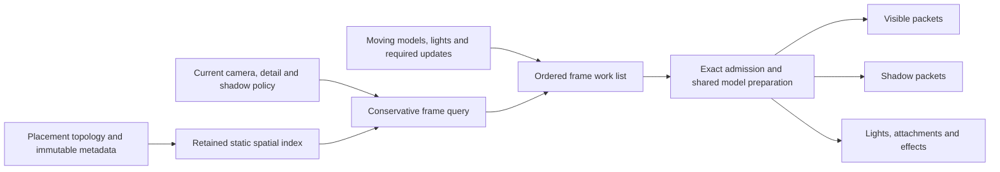

# Model frame work ownership — 2026-09-13

The frame work list reduces this live scene's preparation visits from roughly
23,000 resident placements to 1,612–1,618 candidates. The comparable low-wait
baseline averaged 153.76 FPS and 2.668 ms model preparation; candidate runs
averaged 163.27 / 165.53 FPS and 2.369 / 2.344 ms. These are observed 6–8% FPS
and 11–12% model-time improvements, with the live-population limitations below.

## Why local optimizations kept recurring

Model residency and per-frame preparation had different responsibilities but
used the same traversal domain. Residency retained roughly 22,700 static props
across 49 terrain tiles; the presentation loop visited every placement before
asking whether it could affect this frame. Compact visibility metadata,
cached transforms and early shadow rejection made individual visits cheaper,
but each new responsibility could still multiply its work by total residency.

The correction is an explicit boundary: **resident resources are available;
the frame work list determines which models may enter preparation**. This is
the M2 implementation of the existing retained ownership principle in
[frame performance](frame-performance.md), following the
[shadow preparation measurements](live-shadow-work-2026-09-13.md).

## One model work selection owner

- `m2/visibility.rs` owns registration of the work index alongside existing
  placement topology. It uses the same immutable `SceneryDistance` metadata as
  current visibility and shadow policy. Static membership changes rebuild a
  balanced spatial hierarchy within each native size class. Dynamic-only
  publication retains the hierarchy when static identities and indices match.
- `m2/frame_work.rs` produces the frame's ordered candidate union. Distance
  queries reject spatial subtrees before visiting their model records. They
  include both ordinary fade distance and shadow distance, so camera-invisible
  shadow casters remain eligible. Moving models, light owners and unclassified
  inputs retain their required traversal. Their detailed admission still
  follows the existing native behavior.
- `m2_spatial.rs` owns the distance constants and arithmetic. Broad query
  bounds conservatively cover rounding in the existing ordinary and shadow
  calculations; exact admission continues to use those original calculations.
  The broad query changes neither draw distance nor fade/shadow boundaries.
- `M2Frame` consumes this list instead of `0..placements.len()`. Exact camera,
  portal, shadow, opacity and parent rules refine the candidate set. Visible
  and shadow packets still share preparation and bone storage. Spatial query
  order is restored to placement order before effects, random consumption,
  parent transforms or transparent ties can observe it.
- Effect publication refreshes only the unvisited effect tail after ordinary
  parents have prepared. Placement-indexed shadow results start with explicit
  empty entries, including omitted scenery and newly appended effects.

There is no new worker queue, frame-to-frame visible-result cache or duplicate
simulation owner. Camera motion queries current data each frame; it does not
rebuild static topology. Mesh resources remain resident for streaming and
collision. Offscreen callbacks and light owners are preserved.

## Guard against recurrence

New model packet/effect work belongs behind the common work-list boundary.
A feature requiring otherwise invisible models must register that requirement
with selection, rather than adding an independent resident-world scan to
presentation. Residency and topology operations may visit all owned resources;
per-frame packet preparation must demonstrate why an owner needs a visit.

The scaling contract is tested through both query and rendering:

- A scene with 20,000 distant props keeps the work list limited to a nearby
  prop, a moving owner and a required light owner. Removal/remapping also
  verifies that old placement indices cannot survive a topology change.
- The real model/shadow packet regression adds 4,096 distant resident props.
  They add no preparation visits: at most the original nine conservative
  nearby candidates are visited, and at most 64 static distance tests run.
  Existing assertions still require the same visible draws, offscreen
  casters and shared bone palettes at both tested shadow qualities.
- Native ordinary-distance and shadow-distance fixtures exercise query
  equivalence across classes, transforms, fade boundaries and unusual inputs.
- Existing unit, vehicle, equipment, retirement, effect and WMO portal tests
  preserve ordering, current transforms and offscreen behavior.

These are structural assertions, not machine-dependent timing thresholds.
They do not guarantee constant work when the number of legitimately relevant
models, lights, or dynamic updates grows. Accepted-model preparation remains
serial and retains its existing animation/material/effect work.

## Matched live results

The baseline is the already optimized executable from `042952cd`'s measured
source, not the earlier unoptimized Build 125 diagnostic. Both binaries use
`test-client`: opt-level 2, thin LTO, debug level 1 and incremental compilation.
The new candidate derives from `042952cd` with the work-selection changes.

| Run | FPS | Frame ms | Model prep ms | Selection ms | Traversal ms | Record ms | Queue-present ms | Worst frame ms |
| --- | ---: | ---: | ---: | ---: | ---: | ---: | ---: | ---: |
| `before-one` | 93.16 | 10.734 | 3.049 | — | 2.690 | 0.948 | 3.791 | 21.681 |
| `after-one` | 163.27 | 6.125 | 2.369 | 0.045 | 2.053 | 0.975 | 0.123 | 46.889 |
| `before-two` | 153.76 | 6.504 | 2.668 | — | 2.382 | 0.961 | 0.122 | 48.109 |
| `after-two` | 165.53 | 6.041 | 2.344 | 0.044 | 2.034 | 0.968 | 0.122 | 43.970 |

The selection scope is new; baseline selection/rejection work is included in
its traversal scope. Compare total model preparation to avoid mistaking moved
timing boundaries for a saving. Parent/child scopes overlap and cannot be summed.

`before-one` is excluded from the FPS gain comparison: its 3.791 ms
queue-present call is a different presentation state. The other three runs
all average about 0.122 ms there. The candidate's new selection phase costs
0.044–0.045 ms. Previous early rejection already made distant visits cheap;
removing about 93% of visits therefore saves about 0.3 ms in the comparable
model scope, not 93% of model preparation time. Most remaining time is within
preparation of selected candidates; its bone/material/effect contributions
have not been individually isolated here.

Capture-time workload:

| Run | Resident placements | Dynamic placements | Frame visits | Static distance tests | Visible draws | Environment shadow packets |
| --- | ---: | ---: | ---: | ---: | ---: | ---: |
| `before-one` | 23206 | 478 | — | — | 369 | 781 |
| `after-one` | 22782 | 54 | 1618 | 2532 | 369 | 800 |
| `before-two` | 23178 | 450 | — | — | 369 | 782 |
| `after-two` | 22776 | 48 | 1612 | 2532 | 369 | 781 |

All four captures retain exactly 22,728 static placements. Dynamic population
varies substantially, as shown above; session/world service also fell from
0.913 ms in `before-two` to 0.839 / 0.817 ms in the candidates. These are not
identical replays, and the entire observed FPS difference cannot be assigned
precisely to work selection. The structural scaling regressions establish the
reduced iteration domain independently of these timing differences.

Conditions are Soap at the Orgrimmar gate, GTX 1070, 2560x1440
fullscreen-windowed, VSync off, shadow quality 5, farclip 1277,
environmentDetail 1.5, the installed Testing profile, and 49 terrain tiles.
The normal client loop, server traffic, world services, UI, audio and FPS
overlay remain active. CPU profiling is on; GPU timestamp queries are off.
Stock WoW and the local servers remain running. Population and realm time vary.

Each launch settles for 20 seconds and captures through the renderer before
the measurement marker. Analysis weights the 30 two-second reports ending
10–70 seconds after the marker, covering about 60 seconds. No compilation or
test execution overlaps those measurement windows. After the measurements,
visual review of `before-two` and `after-two` confirms the same camera,
terrain, buildings, props and character, with live animation/time variation.
The scenes are live rather than pixel-identical replays. This evaluates one
stationary view, not combat or travel. Long-frame spikes remain in both versions.

Earlier diagnostics showed approximately 3.7 ms versus 0.12 ms inside the
same queue-present call on unchanged binaries. That presentation-state
variation is separate from frame selection and must not be credited to it.
Inspect the queue-present column when interpreting these comparisons.

## Validation and evidence

The complete workspace all-feature suite passed: 1,356 tests, 26 ignored.
After strengthening the native rendering regression, the final complete
runtime library rerun passed: 343 tests, 21 ignored. Workspace Clippy with
all targets/features and warnings denied, and formatting, also passed.
The first strengthened assertion incorrectly demanded exactly six nearby
candidates; the conservative query returned eight. The corrected contract
allows the original nine candidates while excluding all added distant props.
The assertion failure poisoned the shared SDL lock; the clean runtime rerun
also passed the five tests affected by that lock. No production change was
needed for this assertion correction.

Candidate metadata remains development Build 125. No new installer number is
reserved or installed; these are sealed diagnostic binaries using the real
client loop. Final source hashes are verified against the snapshot taken
after validation and before the optimized build.

SHA-256:

- `live-shadow-prefilter.exe`: `64FC45F413B243F81663ABD532CB716D5149384603BFE664E434E8796AEFF4E7`.
- `live-model-worklist.exe`: `736350FC842B9A28FA2724937E430A1AA3D490AD58F1EF0E48ACC6B8CA593FC9`.

Evidence in the canonical checkout's `target/`:

- `model-work-{before,after}-{one,two}.log`, their `-summary.json`,
  `.scopes.json`, `.vulkan.json` and original `-scene.ppm` renderer captures;
  corresponding `-scene.png` files were converted after all measurements.
- `frame-work-checks.log`, `frame-work-final-checks.log` (the assertion failure),
  `frame-work-verified-checks.log`, `model-work-build.log` and
  `model-work-evaluation.log`.
- `model-work-source-final.json`, `start-frame-work-comparison.ps1`,
  `analyze-live-fps.py` and `analyze-live-scopes.py` preserve source identity,
  launch conditions and the report-window analysis.

## Scope of the architectural finding

This repairs the all-resident M2 presentation traversal. Other owners have
different membership and invalidation rules: WMO root collision queries
already retain a spatial hierarchy, and game-object renderer publication
already checks a scene revision. Some game-object synchronization still walks
its retained dynamic population each service frame. Its last measured
combined residency/collision scope was about 0.35 ms; it has not been changed
or independently split by this work.

The common rule is explicit ownership of registration, invalidation and frame
work, preserving each owner's required lifetimes and ordering. Future changes
should show a bounded work contract and representative live measurements at
the affected owner boundary.
