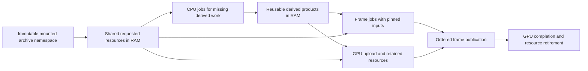

# Resource caching, reusable work and residency

Status: design for implementation, 2026-09-15. This extends the
[CPU frame-job design](cpu-frame-job-design.md). It does not implement caching,
change gameplay or establish a new performance result.

## Purpose and decisions

Reduce repeated I/O, decoding, allocation, preparation and GPU upload while
preserving stock gameplay. Use available memory to retain useful results and
available background capacity to prepare justified demand. Neither spare RAM
nor a cache hit is permission to activate an object or skip its required update.

The architecture has four owners:

1. Asset and domain modules own typed resources, keys and validity rules.
2. Runtime coordinates demand, shared pending work, budgets and publication.
3. CPU jobs produce missing immutable resources and reusable derived results.
4. Rendering owns GPU residency, upload dependencies and retirement.

There is no universal untyped cache inside `solarity-cpu`. The CPU module knows
job dependencies and byte reservations, not M2 animation semantics or terrain
visibility. It must not become an asset service locator.

Hardware L1/L2/L3 caching remains processor-managed. Compact storage, locality
and appropriate batches support it. This design controls software retention in
RAM and GPU resource residency. GPU-to-CPU readback is not a general cache path.



Reuse must remove enough total work to matter to the 0.833 ms frame target.
A high hit rate alone is not success: cache lookup, validation, memory traffic
and eviction can cost more than recomputing a cheap result.

## Stock evidence and current code

Evidence refers to the fingerprinted build-12340 executable and the
[stock operating-model review](stock-performance-review-2026-09-15.md).
The distinction between recovered behavior and a modern implementation choice
is part of the contract.

| Evidence | Required behavior / limit |
| --- | --- |
| `0081C390`, `0081F8F0`, `00834810` | Shared M2 resource identity is separate from per-instance state. Resource lookup flags matter. |
| `00827190`, `00831C30`, `0083DA10` | Sequence-specific requests, variation/alias handling and shared pending consumers exist. Do not eagerly read every external animation as a substitute for readiness handling. Full late-readiness behavior still needs focused validation. |
| `0083DC90`, `00835970`, `0081C290` | Qualified final releases enter a timed list; reacquisition removes them; ordinary collection uses a 10,000 ms age threshold. The force argument bypasses age, but its existence does not establish a memory-pressure policy. |
| `0081C790`, `008368B0` | A separate aged graphics-resource list exists. Its complete eligibility rules are not established; do not apply ten seconds to all GPU resources. |
| `007831A0`, `00780860`, `007B5950`, `007B6B00` | Current camera/window demand, request ordering and required loading stages remain authoritative. Cache residence is not terrain admission. |
| `00823F10`, `00821A20`, `00832450`, `00832260` | Scene registration, render demand and callback/event processing have separate lifetimes. |
| `004BE9C0`, `006C3FC0`, `006C2480`, `006C8CC0` | Font/glyph reuse precedes rasterization. The inspected placement path examines eight atlas slots and can reclaim placement. It does not prove unbounded retention or a universal font-cache byte budget. |
| `004B5FE0`, `006AFFD0` | Texture format and mip handling remain operation-specific. Do not silently reduce quality or expand every compressed texture to RGBA. |
| `0087EE60`, `00879AE0`, `00877850` | Sound resource ownership and live voice admission are different responsibilities. A cached payload is not a playing voice. Exact global cache eviction policy is unresolved. |

The native lifetime oracle now verifies 112 focused M2 lookup-insertion,
release/reacquire and collection cases, including the ten-second boundary,
ordinary clock wrap and signed subtraction boundaries. The recovered new-resource
insertion block at `0081C698` skips hash insertion when lookup flag `0x8` is set;
`+0x144` is the hash backlink tested by final release, not a loaded boolean.
An existing lookup hit precedes that insertion decision. The probes do not
establish flags selected by every gameplay caller or every forced collector
caller. Normal collection must use the proven cache clock semantics, not pose
time, movement distance or frame count.

Current useful foundations and gaps:

- [M2ModelCache](../../crates/asset/src/cache/m2_model/mod.rs) shares immutable
  decoded models by namespace and canonical path. The cutover now retains qualified
  cache-only sources for stock's signed 10,000 ms release age and schedules
  namespace maintenance on the CPU pool. Sharing pending loads across independent
  cache owners and accounting the complete payload graph remain required.
- [M2AnimationSet loading](../../crates/asset/src/model/animation/mod.rs)
  reads every available external sequence and decodes its tracks. The temporary
  encoded payloads are dropped; do not count them as permanently retained.
- Several runtime services construct their own M2 caches. This provides an
  opportunity to share requests across owners, but is not proof that every
  model currently has duplicate live allocations. Count identities first.
- [BLP sources](../../crates/asset/src/cache/blp_texture.rs) already retain
  compressed authored payloads; [texture residency](blp-texture-residency.md)
  describes format, atlas and GPU identity boundaries. Preserve them.
- [Font state](../../crates/ui/src/font/gxu_font_util/state.rs) already shares
  faces, coverage and metrics. Add bounded lifetime/accounting; do not replace
  it with a second cache that rasterizes the same glyphs again.
- [SoundCache](../../crates/media/src/audio/cache/sound_cache.rs) shares encoded
  payloads independently of voice ownership. Do not merge voices with payloads.
- Terrain publication checks stored streaming demand; the
  [streaming coordinator](../../crates/runtime/src/application/terrain_coordinator/streaming.rs)
  currently polls/publishes before replacing that demand with the incoming
  window. Correct this ordering in implementation before speculative residency.
- GPU generations already have retirement ownership. CPU cache eviction must
  cooperate with it, rather than invalidating in-flight handles.

## Gameplay invariants

These apply on cache hits, misses, reloads, cancellation and memory pressure:

- Preserve archive precedence, canonical paths, supported format rules and
  stock error/missing-input behavior. No alternative asset search, placeholder,
  guessed animation, lower mip or reduced effect density is introduced.
- Live scene membership, collision, WMO portal visibility, light registration
  and shadow demand are established by their normal owners. A cached mountain
  or tile is not admitted merely because its data is available.
- Preserve the existing MDDF/MODF/MODD identity and overlap rules from
  [terrain streaming](terrain-streaming.md). Retention must not duplicate a
  live placement or change equal-distance request order.
- A newly created instance gets the stock-required initial clocks, RNG draws,
  callbacks and effect state. Reacquiring its immutable model does not resurrect
  an old instance's flame, ribbon trail, sound event cursor or movement state.
- A retained live instance moving between terrain owners keeps its valid state;
  promotion into another tile must not restart it.
- Cached numeric output never suppresses required callbacks, animation event
  intervals, random consumption, sound admission or gameplay integration.
- Cache completion cannot call gameplay code from a worker. Publication and
  readiness delivery occur at the existing ordered owner boundary.
- Faster actual availability is allowed; do not insert delays to imitate disk
  latency. Preserve the logical readiness/activation rule. If stock's behavior
  while a sequence is pending is unknown, research it before changing that path.
- In-flight readers pin a consistent generation. Missing required current-frame
  work is not replaced with stale results to hide a frame-budget miss.

## Identity and cache layers

Use an asset-system-issued `AssetNamespaceId` for one immutable mounted archive
stack, including locale and selection configuration. Stores sharing that exact
namespace may share resources. Independent clients, changed mount plans or
replacement generations cannot collide through a path-only global map.
Within a namespace, the ordinary normalized virtual path still selects HD
replacements through archive precedence; it does not request both HD and stock
copies. Record the selected archive/entry as provenance.

Namespace identity is established at mount construction. Do not hash every
asset or stat its files every frame. Hot replacement is not added by this design;
if later supported, it creates a new namespace/generation explicitly.

| Layer | Identity / validity | What may be shared |
| --- | --- | --- |
| Parsed immutable source | Namespace, canonical path, resource kind and relevant parse contract | M2 body metadata, requested SKIN profile, WMO source, BLP encoded mip payloads, encoded sound |
| Animation companion | Model resource generation, resolved external companion/sequence identity and decode contract | Requested key data, alias-related storage where stock uses the same underlying payload |
| Derived immutable resource | Input resource generations plus every relevant option | Draw templates, validated mesh joins, bone dependency maps, static local bounds, composed appearance images |
| Font metrics and coverage | Face namespace/generation, exact size/rasterization inputs and scalar/glyph identity; pair identity for kerning | CPU metrics/coverage across text owners; GPU atlas placement is a separate generation |
| Instance-retained result | Owner generation plus explicit input revisions | Appearance plan, tooltip/layout result, valid collision-query data and other owner-local products |
| Exact frame computation | Frame/input identity and all mathematical dependencies | Only pure outputs whose equality contract is proven; independent live simulation remains outside the entry |
| GPU resource | Source/derived generation plus format, color space, mip selection and device generation as applicable | Images, mesh buffers, immutable bindings/templates; submission pins remain explicit |

Do not use one enormous key containing every game setting. Each domain defines
the inputs that actually affect its value. Conversely, path or model identity
alone cannot identify a player appearance, font rasterization or camera-dependent
pose. Hashes accelerate lookup; key equality remains authoritative.

A settings change invalidates the affected derived/GPU products while retaining
still-valid source data. A device reset invalidates GPU generations without
automatically throwing away decoded CPU models. Stable handles resolve during
residency/appearance changes; frame kernels do not repeat global cache lookups
for every draw or glyph.

## Shared requests and lifecycle

One typed request index exists per namespace/domain. Runtime invokes it through
asset/domain APIs; worker jobs carry resolved immutable handles and owned work.
Do not hold a global cache lock while reading archives, decoding or waiting.
A single-owner index with batched request/completion messages is the first
implementation; profiling can justify sharding later. No cache lookup scans
every live resource each frame.

Conceptual interfaces:

| Interface | Contract |
| --- | --- |
| `ResourceRequest<K>` | Typed key, consumer generation, demand class and operation requirements |
| `ResourceLease<T>` | Pins one ready generation; does not create scene membership |
| `PendingResource<T>` | Shared readiness token plus a distinct consumer subscription |
| `ByteReservation` | Accounts for expected retained and transient allocations before admission |
| `PreparedProduct<T>` | Immutable completed value and source generations, not yet domain-published |
| `ResidencyTransaction` | Publishes the required compatible products at an ordered owner boundary |
| `RetentionPolicy` | Domain-qualified release/retention eligibility, separate from generic budget ranking |

The entry lifecycle is:

```text
absent -> requested -> reading -> decoding -> ready
                                         -> failed for current consumers
ready -> consumer-pinned -> released/retained -> eligible for eviction
eligible -> retiring -> destroyed
released/retained -> consumer-pinned on valid reacquisition
```

Reading and decoding may have multiple explicitly bounded stages. CPU-ready,
GPU-handle-created, GPU-use-ordered and scene-admitted are distinct facts;
they must not be collapsed into one `loaded` boolean.

Request/complete/release rules:

1. A hit acquires a typed lease. It returns through the same logical publication
   boundary as a completed request, avoiding inline callbacks and reentrancy.
2. A miss registers one in-flight producer before dispatch. Other consumers
   join that producer instead of performing the same decode concurrently.
3. Priority reflects the strongest live consumer. Cancelling one speculative
   consumer cannot cancel a producer needed by the player or another scene.
4. The producer returns a typed result once. Completion validates its request
   generation, reconciles byte reservations, and wakes subscribed consumers.
5. Each consumer validates its own owner/session generation and current demand
   before publishing. An old map result cannot become current after reconnect
   to an equal map/tile key. Stale immutable data may remain only if namespace
   and retention policy still allow it; stale scene state is discarded.
6. No live consumers means a queued request can be cancelled if safe. Running
   work remains owned until a safe boundary/completion; it cannot be detached.
7. Failures fan out to current required consumers with the existing domain
   failure semantics. This design adds no persistent negative-cache TTL,
   retry/backoff loop or fabricated successful result. Later required requests
   follow the domain's proven request policy.
8. Last-consumer release is distinct from cache ownership and GPU use. Retain
   or retire according to the domain policy and outstanding pins.

Lease ownership must be observable without scanning `Arc::strong_count` across
the entire cache each frame. The typed lease controls external pins and emits
batched last-release notifications; the registry holds its separate cache owner.
Arbitrary untracked clones must not bypass that contract. Release notifications
are correctness work and cannot be dropped like diagnostic records. Keep them
bounded through registered entry state/coalescing, with an explicit shutdown
drain. A last-release/reacquire race validates the current lease generation
before entering an eviction list.

Acquire stable resource leases when residency or appearance changes, not once
per draw. A frame epoch pins shared input catalogs and the necessary changing
generations, avoiding a global cache operation for every model packet.

Migrate independent runtime caches into shared request authority without a
giant `Arc<Mutex<AssetStore>>`. Archive access retains its own bounded read
ownership; jobs receive bytes or prepared handles. Synchronous legacy loaders
can remain behind a measured bulk adapter during migration. They must not
be called from a protected frame kernel or block a worker on another job.

## Animation demand and state

Split always-required model metadata from requested companion key data. Retain
sequence descriptors, global-sequence metadata, lookup/variation/alias rules
and bone topology without eagerly loading every external `.anim` payload.
Internal/global tracks remain available as required by their actual storage
and consumers; "load one animation" does not mean omit global channels.

The animation owner requests the dependencies selected by the current sequence,
transition and the stock variation-prefetch path. The resource system merges
matching companion requests. Each frame samples an immutable view of the
required ready channels with explicit resource leases. It cannot race a worker
mutating vectors inside an otherwise shared `M2AnimationSet`.

Alias identity, variation identity and payload identity are related but not
interchangeable. Preserve the caller's sequence/event identity while sharing
the resolved storage that stock shares. Do not use payload deduplication to
merge independent playback clocks or event cursors.

Before implementation, extend native evidence/fixtures for: pending-sequence
selection, late completion, transition/blend timing, missing companion handling,
alias/variation readiness, callbacks while pending and destruction with reads
outstanding. The existing release oracle does not cover these. There is no
guessed identity-pose or old-pose fallback in this design.

## Retention and memory pressure

Retention policies are typed by domain, not a universal LRU/TTL:

| Domain | Initial policy |
| --- | --- |
| Qualified stock M2 shared resources | Preserve normal ten-second release age and reacquisition. Implement qualification from evidence. Force only at a separately verified stock lifecycle boundary; generic pressure does not invent one. |
| Unqualified M2 resource | Preserve its proven immediate final-release behavior, subject to required safe destruction of outstanding work. |
| WMO/terrain source and membership | Apply existing residency/reference rules. Additional purely immutable retention requires explicit eligibility and tests; no borrowed M2 TTL. |
| Pure derived results | Bounded optional retention; release/recompute only when no consumer pins the entry. Validity is independent of replacement ranking. |
| Glyph metrics/coverage and GPU placement | Keep useful shared CPU data under a bounded policy; atlas placement has independent pins/generations. Reclamation must not corrupt retained text UVs. Stock's eight-slot placement path does not define all CPU memory limits. |
| Texture/audio sources | Preserve current source/consumer ownership until their fuller stock retention policy is established. Optional new retention is separately budgeted; no quality/voice-count changes. |
| GPU resources | Rendering controls retirement after last submitted use. No eviction before fence/timeline safety and no universal ten-second rule. |

Runtime sets configurable budgets for optional retained RAM, pending decode
and transient RAM, upload staging, and GPU residency. Device allocations and
system RAM are accounted separately; process private bytes/working set are
observations rather than exact ownership totals. Values are chosen after an
allocation census, not by assuming stock's reported 500 MB is our correct cap.

Reserve known source/output sizes from headers and authored counts. Where exact
decoded growth is not known, request an additional reservation before the next
allocating chunk. Track actual capacities, not only logical lengths. One shared
allocation is counted once even if ten consumers lease it. Staging, decoded
tracks and per-worker scratch are separate allocations and must all be counted.

Pressure handling proceeds without changing content:

1. Stop new speculative work and cancel obsolete queued speculation.
2. Release eligible optional derived/cold entries and expired domain-qualified
   entries. Keep live and in-flight pins intact.
3. Drain safe retirement on the CPU design's bounded background service.
4. Reduce optional retention and speculative concurrency with hysteresis.
   Increase them only after sustained headroom and demonstrated useful reuse.
5. Retain required unmet demand and report the actual limiting reservation or
   live allocation. Do not oscillate between evicting and reloading the same
   needed resource or wait forever for memory pinned by that request itself.

A target is not an absolute guarantee: the required live set plus stock-qualified
retention may exceed a soft target. Report that overage and stop optional growth.
Do not shorten proven M2 grace periods or remove collision to force the number
down. A configured hard admission limit that cannot fit a required transaction
produces an explicit budget-infeasible result for application handling; it is
not an asset-not-found error. Allocation failure and user-visible transition
handling must follow the existing domain contract, with unsupported stock OOM
behavior researched before adding a recovery path.

Reserve a connected required transaction's minimum working set before launching
its expensive stages. If that set is infeasible, diagnose it before taking
partial reservations that can never complete. Outstanding consumers, GPU fences
and retirement bytes appear in the explanation. Budget enforcement itself
must not introduce a new main-thread destructor burst.

For optional pure results, start with a simple bounded recency policy and
coarse reconstruction-cost/size classes. Track reuse after release, bytes
retained, reconstruction avoided and eviction/reload churn. Expensive reused
entries can receive more of the optional budget; never run a global scoring
sort every frame. Use release/touch queues and incremental collection.

## Reusable-work validity

Every cached operation declares its complete inputs and whether it has effects.
Only the pure calculation is reusable. Validate revision tokens from the owning
domains; do not hash whole geometry, poses or UI state every frame to prove
the cache was useful.

| Product | Invalidation contract | Scope |
| --- | --- | --- |
| Draw template / bone dependency map | Resource generation, material/skin interpretation and relevant options | Shared until inputs change |
| Player appearance / composed body texture | Base customization, complete relevant equipment/display data, selected source generations, composition settings | Shared immutable product when inputs truly match; independent player state remains distinct |
| Glyph coverage / metrics | Exact font face, size, rasterization mode, character/glyph and relevant metric inputs | Shared across text objects; do not pre-rasterize all Unicode |
| Text layout | Text content/revision, font/metric generation, wrapping/width and relevant layout inputs | Owner-retained; scroll transforms/clipping need not invalidate coverage |
| Tooltip content/layout | Subject identity plus relevant item/unit/inventory/data revisions, locale and layout inputs | Dynamic facts invalidate their own product; a subject ID alone is insufficient |
| Static spatial metadata | Membership, resource bounds and placement transform revisions | Local owner/index updates; camera movement alone does not rebuild static metadata |
| Pose output | Exact sequence/global clocks, transitions, overrides, required bones, transform/camera dependence and model generation | Initially only existing owner-local reuse or within-frame exact reuse with proven keys |
| Receiver/visibility/collision result | Relevant spatial membership, transforms, query volume, lights/camera and policy revisions | Existing proven owner-local validity first; no broad cross-frame reuse by assumption |

No time quantization, approximate camera equality, shared animated-character
clock or changed floating-point evaluation is authorized. A full pose cache
whose key construction and copying exceeds sampling cost should not be built.
Broader pose sharing and cross-frame visibility/light caching remain gated by
proof and measurement; they are not prerequisites for shared asset demand.

Eviction removes optional reuse, not required state. Pure cache-disabled and
cache-enabled execution must produce equivalent required outputs and event
traces under the same inputs. Cache hits still execute the surrounding ordered
simulation/event phases. A validated input-generation mismatch recomputes the
result; it does not silently use stale data.

## Invalidation delivery

Keys describe validity; they also need reliable producers of change. Each
domain owns revision tokens for the inputs it mutates and a local journal of
affected owners/products. Resource replacement, equipment changes, font metrics,
spatial membership and relevant settings advance the appropriate revisions.
A clock advancing does not invalidate unrelated static products.

Publish revision changes at the ordered mutation boundary before consumers
can use cached products. Worker output records its input revisions and is
rejected if they no longer match at publication. Invalidation is not deferred
until an asynchronous rebuild finishes: a stale value becomes unusable
immediately, while recomputation can be scheduled according to demand.

Keep reverse dependencies local and coalesce duplicate notifications. Do not
walk every cached resource on each edit or allocate one notification per glyph.
Invalidation is correctness state and cannot be dropped under pressure. Bound
its representation through dirty owner/product state, with an explicit drain
and lifetime for the dependency links. Diagnostic record-loss rules never apply
to invalidation. Test repeated changes while an earlier rebuild is in flight,
owner ID reuse, and multiple cached products depending on the same source.

## Prefetch and available resources

Prefetch has its own consumer subscription and accounting. It may prepare
immutable data; it never creates a live instance, advances a clock, consumes
gameplay RNG, starts audio or registers collision/lights.

First implement the demand already evidenced in stock: the current streaming
window/request order, required world-entry dependencies and animation variation
requests. Use spare capacity to complete those earlier. Do not expand the
gameplay residency window merely because RAM is available.

Additional prediction is a later, explicit data-only policy: bounded candidates
from existing known resource references may be read/decoded before they become
required. It starts disabled until parity and cost tests pass. No speculative
instance construction, arbitrary archive-wide scanning or unsupported fallback
path is part of it. Required requests keep their logical order and can join an
already running compatible producer without consuming a second load slot.

Admit speculation only when all relevant budgets permit it: optional bytes,
transient peak bytes, background CPU service, archive I/O and upload capacity.
Start CPU-only; do not eagerly upload every predicted asset. GPU prewarming
needs an explicit likely-use case and rendering admission budget. An available
RAM measurement cannot prove that the GPU or main publication path has capacity.

Prediction changes cancel obsolete subscriptions. A running operation remains
owned and may produce a retainable immutable result, but cannot publish stale
scene membership. Failed pure speculation is diagnostic and discarded; a later
required request uses the normal failure contract. Do not turn a speculative
failure for an unused asset into a gameplay error or a permanent negative entry.

The broker cannot reorder scene-visible completion effects based on which
cache entry arrived first. Faster data can become available earlier, but its
activation still passes current generation, demand, stock ordering and required
transaction checks. Preserve exact equal-distance terrain tie behavior described
in the native streaming fixtures.

## CPU/GPU integration

Connect resource readiness to the CPU graph through shared dependency tokens.
The frame kernel receives ready leased resources, not a service handle that
can secretly block on a cache miss. A missing prerequisite belongs in a loading
or readiness continuation before that kernel becomes runnable.

GPU lookup returns a rendering-owned resource generation or a pending upload
dependency. Where queue ordering or explicit GPU synchronization establishes
use readiness, do not add a host fence wait. CPU-ready data and a recorded
upload do not by themselves permit premature GPU use.

Retire superseded images, buffers, descriptors and atlas placement only after
their final users. New requests cannot reacquire a generation already invalidated
for retirement; they create/reuse the next valid generation. Keep retirement
bounded and distinguish logical eviction from physically reclaimed bytes.

CPU source retention can save reload/decode after GPU eviction; GPU retention
can save upload after CPU scratch release. Neither tier should force duplicate
permanent raw and decoded copies without a consumer/rebuild justification.
Caches pin only their own intended tier and necessary dependencies, avoiding
cycles of strong references between resource entries and consumer subscriptions.

Classify optional cache-to-cache dependencies separately from active frame,
instance and GPU pins. Reclaim inactive derived dependents before declaring
their source unreclaimable; otherwise optional templates can keep every model
alive forever. Treat such dependency groups as a bounded retirement unit,
preserving the source domain's actual last-release/age rules and all real
in-flight readers. Accounting must show which cache is preventing release.

## Diagnostics and performance contracts

Extend the CPU design's F10 reports with resource request IDs and generations:

- Hits, misses and merged requests by domain; producer count per immutable key.
- Read/decode/derive/upload counts and elapsed CPU/service time; required versus
  speculative origins and promotions.
- Ready-but-unpublished time, actual consumer waits and the blocking prerequisite.
- Retained, pinned, pending, scratch, staging and retired bytes; high-water marks
  and reservation failures with the largest owning categories.
- Eviction/reload churn, speculative reuse versus unused retirement, and cache
  validation/lookup cost. Report known avoided work without inventing a saved-ms
  counter from an unmeasured hypothetical rebuild.
- Live-instance counts separately from cached resources, including collision,
  callback, light, sound and render/shadow membership where applicable.

Use bounded counters/records and the existing off-thread reporter. No formatting,
file writes or whole-cache census on the measured frame path. Detailed catalogs
are opt-in; namespace/asset identifiers suffice, without chat or account data.
Reuse the CPU design's instrumentation-overhead gates and report lost records.

Investigate repeated producer creation for a pinned key, a warm entry missing
despite an equal key, cache entries holding obsolete owner generations, required
demand queued behind speculation, and retired bytes that never drain. A normal
cold miss is not a warning. A high hit rate without a shorter critical path is
not sufficient evidence of improvement.

## Module boundaries and cutover

Follow the [direct cutover decision and rollback point](cpu-frame-job-design.md#direct-cutover-and-review-gates).
The steps below are the implementation checklist for that cutover, not separate
rollout stages; their behavioral and validation requirements still apply.

```text
crates/asset/src/cache/
  mod.rs                     typed cache facade
  identity/                  namespace, keys and generations
  request/                   shared producers, consumers and readiness
  accounting/                allocation identity and byte reservations
  m2/                        body, SKIN, requested animation resource policy
  texture/ / wmo/             domain-specific resource retention
crates/runtime/src/application/resource_residency/
  mod.rs                     demand/publication coordination facade
  demand.rs / budgets.rs / prefetch.rs / transactions.rs / retirement.rs
crates/ui/src/font/           existing face/metric/coverage authority
crates/media/src/audio/cache/ existing payload authority, separate from voices
crates/rendering/src/device/  existing GPU registry/upload/retirement authority
crates/profiling/src/         resource identities and off-thread accounting reports
```

Keep resource-specific policy in its domain. Common request/accounting types
live at the lowest existing dependency boundary that their real consumers can
use; do not create another crate just to host a generic cache abstraction.
Facades stay small; the old flat `m2_model.rs` becomes a folder only when its
new responsibilities require it. No repository-wide reorganization is needed.

| Step | Deliverable | Exit evidence |
| --- | --- | --- |
| 1. Identity and ownership census | Namespace tokens, per-allocation accounting, existing cache/consumer inventory; shared producer API connected to one M2 loader | Same key across two owners produces one resource; pinned bytes are counted once; no global lookup in frame kernels |
| 2. Shared M2 lifecycle | Adopt other M2 consumers, qualification-aware release/reacquisition and safe retirement | Existing 36 native cases plus qualification/lifecycle coverage; surviving instances preserve state while replacement instances initialize correctly |
| 3. Requested animation data | Separate metadata/key payloads and integrate sequence-ready tokens | New native pending/late/alias/missing tests; read/decode counts follow requested dependencies, not all possible sequences |
| 4. Derived common work | Connect draw templates, appearance and existing glyph/metric/layout storage to bounded reuse and revision accounting | Exact output parity; one unrelated owner change does not invalidate others; no duplicate rasterization authority |
| 5. Budgeted residency and prefetch | Current-window-first publication, staged byte reservations, CPU/GPU retirement and stock-evidenced lookahead | Movement/reentry, memory pressure and cancelled demand tests; required work progresses without speculative interference |
| 6. Whole-frame verification | Integrated CPU-job causal report, cache census and matched live comparisons | Lower reconstruction/churn costs and shorter frame paths, with stock behavior and memory limits verified |

Additional predictive prefetch and broad frame-result caching are gated extensions,
not reasons to postpone shared demand, correct lifetime and current-window
publication. Do not declare the work complete with a cache library that the
actual terrain/player/effect consumers do not use.

## Validation and remaining evidence gates

Use deterministic scheduling, clocks and memory reservations in external tests:

- Simultaneous equal requests, miss/complete/release races, fan-out, one consumer
  cancelling, all consumers leaving, error fan-out and shutdown with I/O pending.
- Same path across distinct namespace/locale/archive generations; legacy M2
  extension canonicalization; different skin/appearance/color-space identities.
- Qualified release at 9,999/10,000/10,001 ms, reacquisition, native clock wrap,
  unqualified release and actual verified force callers. Do not generalize the
  oracle beyond its tested interval/qualification domain.
- Leave/reenter a tile, overlapping owners, disconnect/reconnect to the same
  coordinates, portal/horizon visibility, initial late model admission, particle
  continuity and sound-event/RNG order on warm and cold paths.
- Exact dependency invalidation for equipment, font size, wrapping, tooltip
  subject data, camera-dependent bones, membership and lights. Include cache
  collisions and deliberately identical output with different event intervals.
- Infeasible required transaction, underestimated transient size, cancelled
  reservation, pinned GPU resources, retirement backlog and a long bulk free.
  No deadlock, hidden main-thread destruction or quality downgrade.
- Optional derived products retaining source resources after every live
  consumer leaves; prove dependency-group reclamation and release accounting
  without breaking any real frame/GPU pin or resetting the qualified age rule.
- Warm/cold/prefetched/cache-disabled pure computations with equivalent logical
  readiness inputs and rendered outputs. Include repeated empty/failed requests;
  speculation must not create extra gameplay callbacks or visible errors.

Measure release builds with matched Soap scene/camera/settings, stationary and
moving through Orgrimmar/tunnel/exterior, world entry, EULA scrolling and repeated
appearance/content churn. Separate CPU-only experiments from 2560x1440/Ultra
presentation. Report frame distributions, useful CPU service, load readiness,
unique resources, peak transient/retained memory and GPU backpressure. More RAM
is justified by demonstrated avoided work or improved latency, not by filling it.

Unresolved stock policies remain explicit implementation gates: full M2 cache
qualification and forced-collection callers, sequence behavior while pending,
complete texture/audio retention, all glyph placement invalidation consumers,
and OOM/required-load failure behavior beyond existing fixtures. Research these
against the pinned binary before wiring behavior-dependent changes. Pure
ownership/accounting and proven shared-request boundaries can proceed meanwhile.

For each implementation slice, record the exact stock address/fixture, the
modern storage/scheduling choice, and the observable invariant tested. Cache
replacement heuristics may choose which eligible pure value to keep; they may
not redefine the domain's eligibility or error contract.

This design authorizes neither a fabricated fallback nor a claim of a particular
FPS or memory reduction. The result must be less required reconstruction and
less critical-path work with unchanged gameplay, not simply a larger cache.
